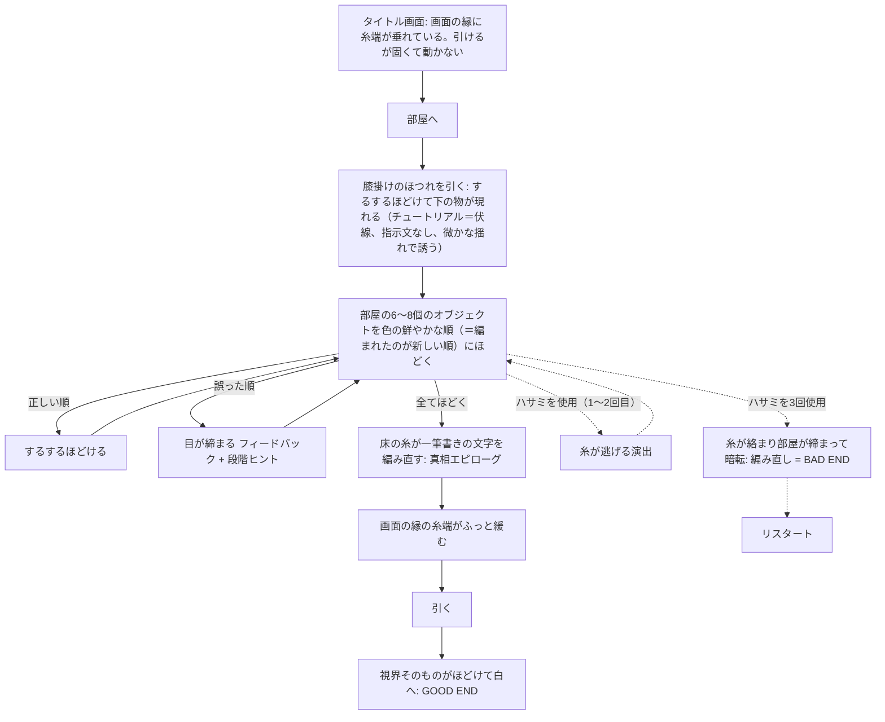

# さいごのひとめ（仮題） 企画

> **2026-07-13 再設計**: プレイヤーは糸状生命体〈イトヌシ〉の体内に閉じ込められた。身体に刻まれた結び印を口から尾へ読み、同じ印の編み物を順にほどく。誤順3回で機嫌が尽き、プレイヤーは一本の糸に変えられて毛玉へ巻き取られる。全て正しくほどくと口が開き脱出できる。旧「彩度順」「膝掛けチュートリアル」「ハサミBAD END」は廃止。

- slug: `last-stitch`
- プレイ時間: 3〜5分
- 実装形式: 静的単体HTML（2D、canvas/SVG/CSSで編み地をプロシージャル表現、ビルド不要）

## 結論

画面の縁（UI枠）から垂れる一本の毛糸のほつれ——「装飾かバグか」という違和感が、最後に「あれはプレイヤー自身の袖口だった。この世界も自分も一本の糸で編まれていた」という一点に回収されるWeb謎。

## 背景

akashic過去5作（zoo-escape=傾ける／still-thread=留まる・重ねる／notification-gale=息を吹きかける／three-forward-two-back=ブラウザ履歴／bookcafe-3d=忍び込んで入れ替える）と、動詞・違和感型・オチ型が被らない新作として企画する。

- 想定導線: X投稿リンクからXアプリ内ブラウザで遊ばれる。
- コア動詞: 「引く（ほどく）」。操作はポインタドラッグのみ。
- センサー・マイク・音を進行条件にしない（game-adr-digest G-014 準拠）。

## 世界観の核

- **単一原理（1文）**: 「この世界は一本の糸で編まれており、最後に編まれた目からしか、ほどくことができない」（実際の編み物の物性に基づく）。
- **ギミックの必然**: 編まれた世界だから、引けばほどける。順序制約は編み物の物性そのもの。
- **行動の必然**: 出口（および自分自身）は編み込まれている。編んだ順の逆＝新しいものから順にほどくことだけが、核（自分）に到達する唯一の道。
- **遠回りの必然**: 間違った箇所を引くと「目が締まる」＝世界はプレイヤーの試行を編み目の締まりとして吸収する。うろついて糸を辿る時間そのものが「編まれた順を読む」行為になる。
- **例外（意図した2つ）**
  1. ハサミ——部屋で唯一「編まれていない」異物。切る近道に見えるが、使うと糸が絡まりBAD END。
  2. 主人公の指先——唯一編み目がない部位＝糸を引く主体である証。
- **オチ（仕様側にのみ記録。ゲーム本文には書かない）**: プレイヤーは編み手が最初に編んだ一目（核）であり、部屋は記憶が積層するように後から編み足された。画面の縁の糸端はプレイヤー自身の袖口。編み手の正体・動機は本文に書き込まず、床の糸文字エピローグでも含みに留める（反転耐性 G-008）。
- ゲーム内では各画面1文以内の含みに留める（説明口調禁止）。

## 体験フロー

## 画面構成

1. **タイトル画面**
   縁の糸端あり。可変高＋`overflow-y:auto`前提。
2. **部屋画面（メイン1画面）**
   正面固定ビュー。全インタラクティブオブジェクトは可視領域の上部70%（＝Xアプリ内ブラウザのセーフゾーン）に配置。100dvh・visualViewport追従は `apps/akashic-games/.claude/skills/threejs-single-file-game/SKILL.md` の「Xアプリ内ブラウザ対応」が正。
3. **GOOD END画面**
   床の糸文字エピローグ→袖口ほどき→白。
4. **BAD END画面**
   絡まり→締まり→暗転。GOOD/BADで演出水準を対称に（G-007）。

実装は静的単体HTML想定（2D。canvas/SVG/CSSで編み地をプロシージャル表現、ビルド不要）。

## ギミック仕様

- **操作**: オブジェクトのほつれをドラッグ（引く）。閾値ドラッグ長＝「糸一段分」（世界内意味）。
- **正順のとき**: 糸が抵抗なく走り、するするほどけるアニメーション→下層が現れる。
- **誤順のとき**: 目が締まる（対象と画面がわずかに収縮、糸が固くなる手応え）。失敗フィードバックは可、答えは書かない。
- **順序手掛かり**: 色の鮮度（新しいほど彩度が高い）。テキストで説明しない。
- **世界律の微反応**: タッチ・ドラッグに応じて画面全体の編み目がわずかに伸縮する（静的配置だけでは装飾に終わるため、コア動詞「引く」への微反応で無言に教える）。
- **段階ヒント**（誤操作の詰まり検知後にのみ後出し。先出し禁止）
  - 段1: 最も鮮やかな物のほつれが微かに揺れる（近接反応）
  - 段2: 色の鮮度差が一時的に強調される（体感）
  - 段3: 「あたらしい目から」の短文表示（明示）
- **ハサミ**: タップ可能。1〜2回目は糸が逃げる演出、3回目でBAD END。
- **演出と可読性の分離**: 読ませる文字（床の糸文字・END文）にblur等をかけない（G-001）。
- **コア判定の純度**: ほどき判定はユーザーのドラッグ移動量のみで計測し、演出由来の移動を混入させない（G-003）。
- **パラメータ外出し**: ドラッグ閾値・ヒント発火条件・アニメーション秒数はURLクエリで上書き可（例 `?drag=120&hint=3`）（G-005）。
- **キャッシュバスター**: `?v=` 運用（G-011）。

## 注意点・未確定点

- **素材**: 編み地はプロシージャル生成前提。オブジェクト6〜8個のシルエットデザインのみ要作成（3人で回る想定）。BGM/SEは任意で進行条件にしない。
- **未確定事項**
  - 正式タイトル
  - オブジェクトの最終リストと編み順（実装時に確定）
  - 編み手の正体の含ませ方（床の糸文字の文言）
- タイトル画面の縁の糸端が「引けるのに動かない」ことの初回フィードバック表現（無反応すぎると気づかれない／反応しすぎると答えを教える）は実機テストで調整する。
- **マイルストーン**: 実装中盤に1回、モバイル実機テスト（ドラッグ閾値・セーフゾーン・可読性確定）。
- 実装後は `akashic-nazo-blind-playtest` を実施し、指摘はPhase 1〜3へ差し戻すループとして回す。

## 初期ADR候補

1. コア操作はポインタドラッグのみ。センサー・マイク・音を進行条件にしない（G-014）
2. 単一原理「最後に編まれた目からしかほどけない」を全パズル仕様の唯一の導出元とする
3. 順序ヒントは彩度（色の鮮度）で表現し、テキストでは書かない。救済は3段階後出し（近接→体感→明示）
4. ハサミ＝唯一の非編み物オブジェクト（意図した例外）であり BAD END 装置。3回目で発動
5. 「縁の糸端＝プレイヤーの袖口」というオチは仕様書のみに記録し、本文には書き込まない（G-008）
6. ドラッグ閾値・ヒント発火・アニメーション秒数はURLクエリ上書き可能にして実機で確定（G-005）
7. 進行必須オブジェクト・UIは可視領域上部70%（Xアプリ内ブラウザセーフゾーン）に配置（G-006）
8. 世界律モチーフは静的配置でなく「タッチへの編み目の微伸縮」という動的微反応で提示する
9. GOOD ENDに床の糸文字エピローグを置き、BAD ENDと演出水準を対称にする（G-007）
10. ほどき判定はユーザードラッグ移動量のみを計測し、演出由来の移動を除外する（G-003）
11. 読ませる文字要素に演出エフェクトをかけない（G-001）
12. 実装中盤にモバイル実機テストのマイルストーンを置く

## 次に作るもの

1. auto-devへ本企画書を渡して実装（単体HTML、`apps/akashic-games/last-stitch/`）。着手時に本企画書の初期ADR候補からADR.mdを起こし、体験仕様の正としてDESIGN.mdを作成する
2. オブジェクト最終リスト＋編み順の確定（実装序盤）
3. 実装中盤のモバイル実機テスト→閾値確定
4. `akashic-nazo-blind-playtest`→差し戻しループ
5. リリース時: キャッシュバスター更新、旧リポ（akashic-games Pages配信）への反映
