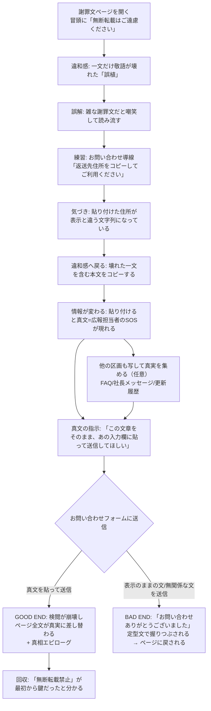

# 『原文ママ』（ディレクトリ名: sic） 企画

## 結論

企業の謝罪文ページに一文だけ「敬語の壊れた誤植」がある——という違和感が、
**コピー（書き写し）した文字だけが真実を語る**世界律によって回収されるWeb謎。
ページ冒頭の「本文の無断転載はご遠慮ください」という定型注意書きが、
最初から「転載（コピー＆ペースト）こそが脱出行動である」ことを告げるヒントだったと最後に分かる。

- プレイ時間: 3〜5分
- 形式: 単体HTML 1ファイル（テキスト主体・ビルド不要・akashic-games 配信）
- 主経路: X投稿リンク → Xアプリ内ブラウザ（iOS/Android）
- 使用機能: クリップボード（copy/paste イベント）のみ。**センサー・マイク・音は進行条件にしない**（G-014準拠）

## 背景

- 既存作と動詞・違和感型・デバイス機能を被らせない新作（過去作: 傾ける/zoo-escape、
  スクロールに逆らって留まる/still-thread、息を吹きかける/notification-gale、
  ブラウザ履歴/three-forward-two-back、3Dステルス入れ替え/bookcafe-3d、
  引いてほどく/last-stitch企画）。本作の動詞は**「書き写す（コピーして貼る）」**で、いずれとも被らない。
- X経由で遊ばれる前提と相性がよい: 「引用して晒す」「コピペで拡散する」という
  Xの文化的動作そのものをコアギミックにする。プレイヤーが日常的にやり慣れた操作なので
  チュートリアルコストが極小。
- スキン被り回避: still-thread の匿名掲示板スキンとは別系統の「企業お知らせページ」スキン。

## 世界観の核

> **この会社では、画面に表示される言葉はすべて検閲済みである。検閲は担当者が書いた本音の文章を、
> 定型テンプレートへ置換して表示している——書き写された文字だけが、置換前の原文のまま外へ出る。**

プレイヤーが読んでいるのは、炎上した企業の謝罪文ページ。だがこの謝罪文は、
監視下に置かれた広報担当者が「書かされて」いる。プレイヤーが読む謝罪文は、
**担当者の本音の上に定型文を貼り重ねた合成物**である。担当者は検閲の正体が
「表示層で本音を定型テンプレートへ置換する処理」であること（＝データそのものを
消しているわけではない）に気づき、コピーされたときにだけ置換前の本音＝SOSが
現れるよう文面の下に仕込んだ。

**壊れた一文＝置換の縫い損ない**。前半はテンプレートの言い回し、後半は担当者の
原文の断片がそのまま漏れている。この不自然な継ぎ目は書き手の雑さではなく、
検閲という機構が働いている痕跡そのものである。さらに担当者はフィルタの癖
（テンプレートとの一致判定）を学習し、わざとテンプレートに一致しない書き方を
混ぜて縫い目を意図的に誘発した。機械は語句の一致は照合できても、文体の継ぎ目の
不自然さまでは判定できない——これは担当者の知恵と抵抗の証である。

**謝罪文スキンの必然（差し替えテストの答え）**: プレイヤーが「雑な謝罪文だ」と
誤解するのは、現実の炎上謝罪文が定型的で空虚だという事前知識から供給される誤解。
学校のお知らせ等の別スキンでは「定型文で本音を塗り潰す」という前提の文脈が弱く、
成立しない。謝罪文というスキンそのものが、この世界律の必然の一部である。

### 三つの必然

- **ギミックの必然**: 検閲は本音を定型テンプレートへ置換する表示層の処理であり、
  文字データそのものを消してはいない。だからコピー（データ層に触れる唯一の行為）だけが
  置換前の原文を運び出せる。
- **行動の必然**: 真文は「読む」だけでは担当者を救えない。お問い合わせフォームは文字データとして
  処理される（＝表示検閲の管轄外）ため、**真文を貼り付けて送信する＝転載する**ことだけが、
  SOSを検閲の外へ届ける行動になる。
- **遠回りの必然**: 謝罪文・FAQ・社長メッセージを読み漁ってうろつく時間は、
  「検閲の綻びを探す監査」そのもの。読み込むほど、壊れた一文の異質さが際立つ。

### 例外の設計（法則を際立たせる2つ）

1. **壊れた一文**: 定型テンプレートへの置換が縫い損なった箇所。前半はテンプレート文、
   後半は担当者の原文の断片がそのまま残る。担当者自身がフィルタの癖を突いて意図的に
   誘発した綻びでもあり、最初に見せる違和感そのもの。
2. **社長写真に焼き込まれたキャプション（画像文字）**: 画像の文字はコピーできない＝
   検閲が完璧に支配する場所。コピーを試みても何も起きないことが、逆に法則を教える。
   後述する「コピーへの世界の対抗反応」の最終段階（画像化）は、この例外2の状態を
   世界の側が後追いで作り出す反撃として地続きに設計する。

### 演出方針: 背徳感の徹底

コピペの快感の正体は「禁止されたことをやっている背徳感」である。ページは終始
「転載禁止」を繰り返し、コピーのたびに世界が嫌がる反応を返す（後述の「コピーへの
世界の対抗反応」）。プレイヤーを単なる読者ではなく、SOSを外へ運び出す**運び屋**にする
——これが本作全体を貫く演出方針である。

### 説明の所在

上記の核・真相は本企画書と実装時の DESIGN.md に全文記録する。
**ゲーム内では各画面1文以内の含みに留める**（説明口調禁止。プレイヤーはクリア後に
核を言い当てられなくてよく、体感で一貫していればよい）。

## 体験フロー

## 画面構成

物理的には**1ページ（縦スクロール）+ 送信結果オーバーレイ**の2画面構成。素材は最小。

### S1: 謝罪文ページ（メイン・唯一の常設画面）

上から順に:

1. **ヘッダ**: 架空企業ロゴ（テキストロゴで可）＋「お知らせ」パンくず。
2. **注意書き**: 「本ページの文章の無断転載・複製はご遠慮ください。」（＝最重要伏線。装飾なしの定型表示）
3. **謝罪文本文**: 定型の謝罪文。中盤に**壊れた一文**（敬語崩壊・にじみ等の最小限の異質さ。
   ただし可読性は完全維持 = G-001）。
4. **社長メッセージ**: 顔写真1枚（キャプション文字は画像に焼き込み＝例外2）＋短いコメント。
   **オプション素材**として、社長が叱責する短尺動画（8秒程度・AI生成、Veo等）を静止画の
   上位互換演出として差し込んでよい（muted autoplay・`poster` に既存の顔写真を使用。
   採否は素材リスト・注意点・未確定点を参照）。
5. **FAQ**: 3〜4問。世界観の含み（各1文以内）を分散配置。
6. **お問い合わせセクション**:
   - 「書面でのお問い合わせは、以下の返送先住所をコピーしてご利用ください」＋住所テキスト
     （＝コピー操作の自然な練習導線。チュートリアルとは名乗らない）
   - 自由記入 textarea ＋ 送信ボタン（進行必須UI。ページ内スクロールコンテンツなので
     Xアプリ内ブラウザの下部占有と干渉しない）

### S2: 送信結果オーバーレイ

- **BAD**: 定型受領文のみの素っ気ないモーダル。「戻る」でS1へ（失敗フィードバック。ヒントは書かない）。
  **オプション**として、社長叱責動画（ミュート・8秒）を差し込む案もある（不採用でも成立する設計を正とする）。
- **GOOD**: 検閲崩壊演出 → S1全文が真文に差し替わった状態で再表示 → 真相エピローグ
  （担当者のその後を1画面）。**GOOD側に最大の見せ場を置く**（G-007）。
- どちらも可変高＋ `overflow-y:auto` 前提で設計（G-004）。

## ギミック仕様

### コア: コピー時の真文注入

- `copy` イベントで `clipboardData.setData` により、選択範囲に対応する**真文**をクリップボードへ書き込む
  （表示DOMは偽文のまま）。偽文と真文は同一データ構造で対応区間を管理する。
- **発動条件**: 一度に選択・コピーした文字数が **20文字以上**（暫定値）のとき真文に置換。
  それ未満は表示どおりの文字列を返す。
  - 世界内の意味: 「短い引用までは検閲AIがリアルタイムで照合できる。長文の照合は間に合わない」
    （恣意パラメータの物語化）。
  - 副次効果: 単語だけコピーする通常利用では異変が起きず、住所（20文字超）で初めて発覚する導線が立つ。
- **確認手段**: お問い合わせ textarea への `paste` で真文が可視化される。メモアプリ等の外部に
  貼っても成立する（外部依存にはしない。textarea だけで完結する）。
- **判定**: 送信時、textarea 内容に真文のコア区間（SOS指示文）が含まれていれば GOOD。
  それ以外は BAD。部分一致の許容範囲は実装時に determinstic に定義（前後の余分な貼り込みは許容）。
- **判定の純度**: 判定はプレイヤーの貼り付け内容のみを見る。プレースホルダ・自動補完等の
  プログラム由来文字列を判定に混入させない（G-003）。

### 区画ごとの真実（探索化）

- 真文は壊れた一文だけの単発仕掛けではなく、ページ全体を区画ごとの虫食いモザイクにする。
  - **謝罪文本文** → SOS（既存のコア導線・GOOD END判定の対象）
  - **FAQ** → 担当者の置かれた状況
  - **社長メッセージ** → 脅している側の生の声
  - **更新履歴** → 過去の犠牲者の痕跡
- コピーという行為の意味を「正解を1回だけ取り出す操作」から「壁のあちこちに懐中電灯を
  当てて回る探索」に変える演出意図で設計する。
- **全区画の閲覧・コピーはクリア必須にしない**（必須手順は増やさない。あくまで任意の寄り道
  であり、判定の対象は引き続き本文コア区間のみ）。

### コピーへの世界の対抗反応（密輸の手触り）

- コピー回数に応じて世界が警戒する段階演出を入れる:
  1. 更新履歴に「不正な複製を検知しました」的な記述が増える。
  2. 注意書きの文言が硬化する（既存の明示ヒント段階の強調表示から、さらに強い表現へ）。
  3. **最終段階**: コピー済み区画のテキストが画像に差し替えられ、コピー不能になる。
- 最終段階（画像化）は、既存の「例外2: 社長写真キャプション（画像文字）＝検閲が完璧な場所」と
  地続きの設定として明記する——検閲が「完璧に支配する場所」を世界の側が後追いで作り出す
  反撃であり、例外2の説明と矛盾しないよう整合させる。
- **詰み防止策**: コア区画（壊れた一文を含む本文段落）は絶対に画像化しない。

### ヒント仕様（段階的後出し・G-002）

初期状態では操作指示ゼロ。雰囲気テキストのみ。詰まり検知（無操作時間・BAD送信回数）で段階解放:

1. **近接反応（常時・無言）**: テキストの長押し選択が始まると、壊れた一文がごくわずかに
   にじむ/震える（世界がコア動詞に微反応する。静的配置だけで終わらせない）。
2. **体感ヒント（無操作 約45秒 or BAD 1回）**: ページ末尾に「更新履歴」が1行増える——
   「当該箇所の誤植とのご指摘をいただいておりますが、**原文ママ**です。」
3. **明示ヒント（無操作 約90秒 or BAD 2回）**: 注意書きが強調表示に変わる——
   「本ページの文章の無断転載・複製は**固く**ご遠慮ください。」（禁止の強調＝逆説の誘導。
   それでも操作手順そのものは書かない）
4. **最終救済（BAD 3回以上）**: 壊れた一文の近くに小さな「引用する」リンクを出現させる
   （タップで当該段落を選択状態にする＝コピー直前まで運ぶ。コピーと貼り付けはプレイヤーに残す）。

失敗後フィードバックは常時可（BAD定型文、コピー20文字未満時は何も起きないこと自体が情報）。

### 代替操作（失敗後にのみ案内）

- クリップボードが機能しない環境（WebView制限等）を送信失敗やコピー無反応で検知した場合に限り、
  「引用する」リンク経由の**転写モード**（当該段落を textarea へ直接転記する in-page 動作）を案内する。
  先出しはしない。
- デスクトップは Ctrl/Cmd+C で同一イベントが発火するため追加対応不要。

### クライマックスの塗り潰し競争（オプション仕様）

- 真文をお問い合わせ textarea に貼ると検閲が気づき、貼った文字が端から定型文に
  塗り替えられ始める。塗り潰され切る前に送信する、という最後の緊張演出。
- 猶予は数秒程度のゆるい設計とし、反射神経は要求しない。失敗してもペナルティなし・
  即再試行可能とする。
- ただし理不尽化リスク（端末差・パフォーマンス差。実機Xアプリ内ブラウザ関連のG-006系リスクの
  延長）があるため、**これはオプション仕様とする**。実装優先度は低く、実機＋ブラインドプレイ
  テストで採否を判断する。

### 体験パラメータ（URLクエリ上書き・G-005）

`?copyMin=20&hint1=45&hint2=90&guardStage1=3&guardStage2=6&overwriteGraceMs=4000&debug=1`
の形式で、コピー発動文字数・ヒント解放秒数・判定許容度に加え、コピーへの対抗反応の
段階閾値（`guardStage1`/`guardStage2` = 何回目のコピーで硬化/画像化するか）・
塗り潰し競争の猶予時間（`overwriteGraceMs`、オプション仕様が採用された場合のみ有効）を
上書き可能にする。実機チューニング後に確定値をコードへ反映（デバッグ経路は残す）。

### Xアプリ内ブラウザ対応

- 進行必須UIはすべて通常フローのスクロールコンテンツ（下部固定UIなし）。可視領域上部70%の
  セーフゾーン制約と自然に整合する。
- 可視高は visualViewport 追従（生の100vh不使用）、実装要件は
  `apps/akashic-games/.claude/skills/threejs-single-file-game/SKILL.md` のセーフゾーン節が正（G-006）。
- 静的配信のため、改修時はキャッシュバスター `?v=` 更新をセットで行う（G-011）。

## 素材リスト（3人チームで回るか）

| 素材 | 数量 | 調達 |
|---|---|---|
| HTML/CSS/JS（単体1ファイル） | 1 | 実装 |
| 偽文/真文の対テキスト（区画別: 謝罪文本文=SOS・FAQ=担当者の状況・社長メッセージ=脅す側の声・更新履歴=過去の犠牲者の痕跡・エピローグ） | 1式 | 執筆のみ |
| 企業ロゴ | 1 | テキストロゴで可（画像不要） |
| 社長顔写真（キャプション焼き込み） | 1 | 生成画像1枚 |
| 社長叱責動画（**オプション**、Veo等でimage-to-video生成、8秒×1〜2本） | 0〜2 | 生成動画（不採用でも成立する設計を正とする） |

画像1枚＋テキストのみで成立。動画はオプションの追加コスト小（静止画からの生成）。
過去作最小級の物量で、3人で確実に回る。

## 注意点・未確定点

- **クリップボードの実機挙動が最大リスク**: iOS WKWebView / Android WebView（Xアプリ内）での
  `copy` イベント＋ `clipboardData.setData` の動作は机上で確定できない。
  **実装中盤に1回、Xアプリ内ブラウザ実機テストをマイルストーンに固定**し、
  不成立なら転写モード（in-page 転記）を主経路に昇格させる設計余地を残す。
- 長押し→選択→コピーはモバイルでやや煩雑な操作。範囲選択の自由度（段落単位スナップの
  是非）は実機で判断。ただし選択補助を入れる場合も判定純度（G-003）を守る。
- 真文（SOSの文面・真相）は制作中に差し替わる前提で、ゲーム内本文は含みに留め、
  結論は DESIGN.md 側に記録する（G-008）。
- 架空企業名・謝罪の題材は実在の炎上事例を連想させないものにする（実装時に確認）。
- **クライマックスの塗り潰し競争はオプション仕様**: 端末差・パフォーマンス差による理不尽化
  リスクがあるため実装優先度は低く、実機＋ブラインドプレイテストで採否を判断する。
- **社長叱責動画（オプション素材）**: 静的Pages配信でのファイルサイズ増と、Xアプリ内
  ブラウザでの自動再生・muted挙動は実機確認が必要。採否はプレイテスト後に判断する。

## 初期ADR候補（実装着手時に ADR.md 初稿となる判断一覧）

1. **コア動詞は「書き写す（コピー＆ペースト）」**。センサー・マイク・音を進行条件にしない（G-014準拠）。
2. **検閲＝本音を定型テンプレートへ置換する表示層の処理**を世界律の技術的根拠とし、
   全要素を核の1文から導出する。導出できない演出・設定は足さず削る。
3. **コピー発動閾値は「一度に20文字以上」**（暫定）。世界内の意味＝検閲AIの照合限界。
   URLクエリ `copyMin` で上書き可、実機で確定。
4. **判定は textarea への貼り付け内容のみ**を見る。真文コア区間の包含判定とし、
   プログラム由来文字列を判定に混入させない。
5. **ヒントは4段階の後出し**（微反応→更新履歴→注意書き強調→「引用する」リンク）。
   初期UIに操作指示・答えを書かない。
6. **代替の転写モードは失敗検知後にのみ案内**。先出し禁止。
7. **GOOD ENDに最大の見せ場**（全文真実化＋真相エピローグ）。BAD ENDは定型文のみで非対称を
   GOOD側に倒す。
8. **例外は2つで固定**: 壊れた一文（置換の縫い損ない）と画像文字（検閲が完璧な場所）。
   無自覚な例外を作らない。
9. **真文・オチの結論は DESIGN.md に記録**し、ゲーム内本文は各画面1文以内の含みに留める。
10. **実装中盤にXアプリ内ブラウザ実機テスト**を必須マイルストーンとする（クリップボード成立確認）。
11. **壊れた一文＝置換の縫い損ない**とし、担当者がフィルタの癖を突いて意図的に誘発した綻び
    という設定で統一する（書き手の雑さではなく検閲の機構的痕跡として導出する）。
12. **真文は区画別に虫食い配置**（謝罪文本文=SOS・FAQ=状況・社長メッセージ=脅す側の声・
    更新履歴=犠牲者の痕跡）とし、探索化を狙う。ただし全区画閲覧はクリア必須手順にしない。
13. **コピー回数に応じた段階的対抗反応**（更新履歴の警告→注意書き硬化→画像化）を入れる。
    コア区画（壊れた一文を含む本文段落）は絶対に画像化しない。
14. **クライマックスの塗り潰し競争はオプション仕様**とし、実装優先度を低く置く。採否は
    実機＋ブラインドプレイテストで判断する。
15. **社長叱責動画（AI生成）はオプション演出**に留め、進行必須情報を動画・音声に載せない
    （muted autoplay・poster フォールバック必須、G-014準拠）。

## 次に作るもの（auto-dev 等への引き継ぎ）

1. `apps/akashic-games/sic/` に単体HTML実装＋ `DESIGN.md`（本企画の世界観の核・真文全文・
   判定仕様を転記した体験仕様の正）＋ `ADR.md`（上記初期ADR候補を初稿に）。
2. 偽文/真文の対テキスト執筆（謝罪文一式・SOS・エピローグ。壊れた一文の文面が最重要）。
3. 実装中盤: Xアプリ内ブラウザ（iOS/Android）実機テスト——クリップボード成立・長押し選択の操作性・
   縮小ビューポートでの可視性を確認し、`copyMin`・ヒント秒数を確定。
4. 通常レビュー後、`akashic-nazo-blind-playtest` でコンテキストゼロの実プレイ検証
   （指摘は Phase 1〜3 へ差し戻して原理から直す）。
5. リリース時: pages 導線追加＋キャッシュバスター `?v=` 更新。
