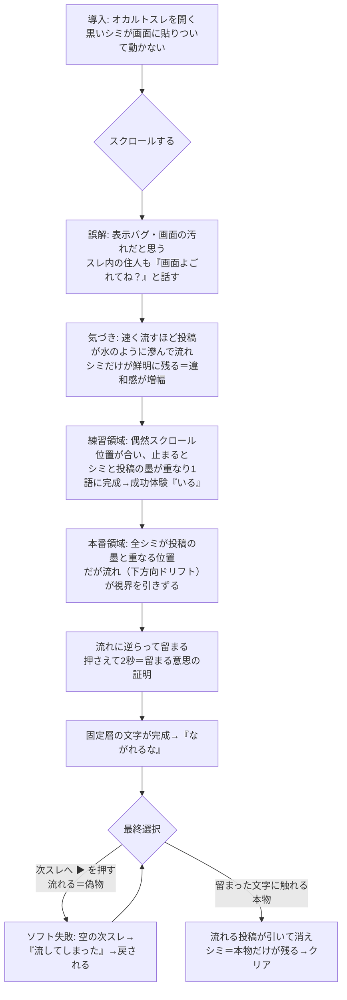

# 流れないスレ（still-thread）企画

> Web謎 企画ドキュメント。設計まで。実装は `auto-dev` 等の別工程に渡す。
> 公開想定 URL: https://games.escape-safari.com/still-thread/

## 結論

オカルトスレをスクロールしても、画面に貼りついて動かない黒い「シミ」がある。プレイヤーは表示バグ・画面の汚れだと誤解する。だが**速く流すほど投稿は水のように滲んで流れ、シミだけが鮮明に残る**——動かないものこそが本物だと気づく。スクロール位置を合わせて流れに逆らって**留まる**と、シミは墨字として完成し「ながれるな」という言葉になる。最後、スレ末尾の「次スレへ ▶」（流れて先へ行く誘い＝偽物）を押さずに、**留まった文字に触れる**とクリア。回収の一文は「流れるものは偽物で、留まるものだけが本物である」。プレイヤーが最初から無意識にやっていた「スクロール（流す）」という行為そのものが、怪異の狙いだったと反転する。

## 背景

- 新事業「Web謎解き（低単価）」向けの単発Web謎。X投稿リンクからXアプリ内ブラウザで遊ばれる想定。
- 舞台は既存世界観の **SAFARI／オカルトスレッド**。イッチ・凸ニキ・超絶ジジイ・怪異好きオネーサンが住人として既にいる 2ch風スレッドの延長線上に置く（新規設定は増やさない）。
- コア動詞は **スクロール（流す／留まる）**。Web謎の主媒体である「縦スクロールする掲示板スレッド」そのものの性質——投稿が流れ去り、スレは次スレへ置き換わり、オカルトスレは消えていく——を謎の芯にする。媒体の宿命を謎の必然に変換する狙い。
- 規模は3〜5分・3人チームで回る最小物量。センサー（傾き）を使わずスクロールだけで成立させ、権限ダイアログも不要にする（zoo-escapeより実装・素材ともに軽い）。

## 世界観の核

**核（1文）**:
> このスレッドという怪異においては、流れるもの（スクロールで過ぎ去る投稿・次スレへの誘い）はすべて偽物で、流れに逆らって留まるもの（画面に貼りついたシミ＝文字）だけが本物である。

この1文から全要素を導出する。導出できない要素は足さない。

**三つの必然**:
- **ギミックの必然（なぜこの世界でスクロール／留まるが意味を持つか）**: オカルトスレは「流れて消える」ことで存在する怪異。過ぎ去る投稿の中に本体は無い。怪異の本当の言葉は「流れに逆らって留まっているもの」にしか宿らない。だから真意を読むには、媒体が最も嫌う行為＝流れを止めて留まる必要がある。スクロールは媒体の本性、留まることは本性への反抗。
- **行動の必然（なぜ最終行動＝次スレへ流されない、がゴールになるか）**: この怪異は人を「次スレへ、次スレへ」と流し続けることで留め置く（永遠にスクロールさせ続ける）。流れを拒み、留まった本物に触れることだけがループを断つ＝クリア。
- **遠回りの必然（詰まってスクロールする時間に意味があるか）**: 詰まって答えを探すほどプレイヤーはスクロールする。だが速く流すほど投稿は滲んで溶け、鮮明なまま残るシミだけが相対的に浮かび上がる。**プレイヤーの困惑（スクロール）が、そのまま本物を炙り出す**。怪異はプレイヤーを流し続けたい（＝留めたい）が、その流し行為が皮肉にも真実を露わにする。遠回りが体験の一部になる。

**恣意パラメータの物語化**:
- **位置合わせ後の保持2秒＝「留まる意思の証明」**: 一瞬の一致は偶然。流れ（ドリフト）に逆らって2秒留まることは「自分は流されない」という意思の証明。怪異は、流れに抗える者にだけ本当の顔を見せる。
- **スクロール速度で投稿が滲む閾値**: 流れているものは形を保てない（偽物だから）。速度が0に落ちて初めて形が定まる。
- **シミの数＝完成語の文字数**（例: 4）。物語上の追加意味は与えず、これ以上の理由付けはしない（複雑化しない）。

**例外の設計**（法則に従わない存在を意図して1つ置く）:
- **先人の固定投稿**: スレ中ほどに、他の投稿と違って**流れず・滲まず、シミのように画面に固定されたまま**の投稿が一つだけある。以前この怪異に遭い、流れずに留まることを選んだ先人の書き込み（内容は「それは よごれじゃない」等、断定はしない断片）。原理（流れる＝偽物／留まる＝本物）を体現する唯一の「留まった人間」であり、それ自体が無言の語りになる。zoo-escapeで確立した「クリアした者が先人になる」パターンと地続き（クリア後、その固定投稿がプレイヤー自身の一筆に増える演出は将来拡張として保留）。

**説明の所在**: この核はドキュメント／READMEにのみ全文記録し、ゲーム内では各画面1文以内の含みに留める（説明口調・ヒント先出し禁止）。プレイヤーはクリア後に核を言い当てられなくてよい。体感で一貫していればよい。

## 体験フロー

導入→気づき→練習→本番→最終行動 の5段で、体感3〜5分。

## 画面構成

実体は**単一の縦スクロール空間（1本のスレッド）**＋数個のオーバーレイ状態。ページ遷移はほぼ無く、スクロール位置に応じて領域が切り替わる。Xアプリ内ブラウザ前提で、進行必須要素はすべて可視領域**上部70%（セーフゾーン）**に置く。

| # | 画面／領域 | 役割 | セーフゾーン上の扱い |
|---|-----------|------|----------------------|
| 1 | タイトル／導入オーバーレイ | スレを開く。導入1文「画面に、動かない黒い点がある。」→「はじめる」 | 中央・上部70%内 |
| 2 | スレッド本体（縦スクロール） | 導入部・練習領域・先人の固定投稿・本番領域・フッターを内包する1本の連続空間 | 進行必須の墨・シミは上部70%内に配置 |
| 2a | 固定層（`position:fixed` のシミ4片） | スクロールに追従せず画面に貼りつく。常に鮮明。上部70%の定位置 | 常に上部70%内（visualViewport追従で再配置） |
| 2b | 練習領域 | 1〜2片のシミの下を補完墨が通過。止まると1語完成（成功体験） | 完成文字は上部70%内 |
| 2c | 本番領域 | 4片すべての補完墨が同時に重なる位置。下方向ドリフトあり | 完成文字・留まる対象は上部70%内 |
| 2d | フッター「次スレへ ▶」 | 流れて先へ行く誘い（囮）。本番完成後は上部70%へも浮上して選択を迫る | 囮のため下部可でも、選択時は上部70%に浮上 |
| 3 | 完成／クリア演出オーバーレイ | 流れる投稿が水のように引いて消え、シミ＝本物だけが残る。回収の一文 | 中央・上部70%内 |
| 4 | ソフト失敗オーバーレイ | 「次スレへ」を押した時。空の次スレ→「流してしまった」→本番へ戻す | 中央・上部70%内 |

**技術判断: Three.js は使わない。DOM/CSS ベースで実装する。** 本作の芯は「スクロールする掲示板スレッド」そのものであり、DOMの縦スクロール＋`position:fixed`の固定層＋スクロール速度に連動したCSSフィルタ（`filter: blur()`／`opacity`）で成立する。WebGLは不要で、その方が軽く・媒体に忠実で・3人チームで回る。単体HTML1ファイル＋画像少数、ビルド不要、静的配信。

**Xアプリ内ブラウザ実装要件**（`threejs-single-file-game` SKILL「セーフゾーン実装」に準拠。3Dでなくとも同じ原則を適用）:
- `100vh` 不使用。`100dvh` を基本にJS計測フォールバック（`window.innerHeight`→CSS変数）。
- `window.visualViewport` の `resize`／`scroll` を監視し、固定層シミの位置を毎回再計算（`position:fixed` はXアプリ内ブラウザでURLバー伸縮時にズレるため、JSで `visualViewport.offsetTop/height` を用いて固定層を translate 補正する）。
- 進行必須（シミ・補完墨・完成文字・留まる対象・先人の固定投稿）は上部70%内。下部25〜30%は囮の「次スレへ」以外の進行必須物を置かない。
- `env(safe-area-inset-bottom)` を下部余白に算入。本番完成時に浮上する「次スレへ」囮と「留まった文字」は互いを覆わないよう左右／上下に分けて配置（自前オーバーレイでの occlusion を作らない）。
- サポート最小ビューポート縦600px（390×600・852×600）で成立を実装完了基準にする。

## ギミック仕様

### コアギミック: スクロールで位置合わせ → 留まって完成

1. **固定層（シミ）**: 画面上部70%の定位置に半透明の墨のシミ4片を `position:fixed` で置く。各片は仮名1文字の**不完全なストローク（片割れ）**。スクロールしても動かず常に鮮明。初見は「表示バグ・汚れ」に見える。
2. **補完墨（流れる側）**: スクロールする投稿群の中に、各シミの**補完ストローク（もう片割れ）**が仕込まれている。特定のスクロール位置でだけ、補完墨がシミの真下に来て**2つの片割れが1文字に完成**する。大半の位置では重ならず、シミはノイズに見える（誤解の維持）。
3. **完成判定**: `scrollTop` を監視。補完墨の目標位置（スクロール量）とシミ固定位置の重なりが許容誤差内、**かつスクロールが静止（`scrollTop` が300ms以上安定）**したら、その片の blur が晴れ、2片が鮮明な墨字に結合して微かに発光。
4. **速度連動の世界反応（コア動詞への微反応・必須要件）**:
   - **速く流す**: 投稿群に縦方向モーションブラー＋わずかな脱色を掛け（`filter: blur()` を `scrollVelocity` に比例）、背景に下方向へ流れる水流の微テクスチャを重ねる。**シミは一切ブラーしない**（流れないから）。→ 流すほどシミだけが際立つ（遠回りの必然の視覚化）。
   - **止まる**: 投稿が鮮明に定まり、環境音が静まる。近傍に完成目標があるシミは微かに脈動（発光）して「ここで留まれ」を無言で示唆。
5. **練習領域（気づき→成功体験・伏線）**: 1〜2片が完成する平易な地点。許容誤差を広く、ドリフト無し。止まるだけで自動的に2秒経過し完成。完成語は **「いる」**（居る／視てる、のオカルト的含み）。操作説明はしない——「止まると読める」という手触りだけを与える。**この操作は本番で『留まる＝本物を選ぶ』という別の意味で再利用される（伏線であって説明ではない）**。
6. **本番領域（留まる意思の証明）**: 4片すべてが同時に重なる唯一の位置。ここでは**下方向ドリフト（自動スクロール）が視界を引きずる**（怪異が流そうとする）。プレイヤーは流れに逆らって留まる必要がある。
   - **「留まる」ジェスチャ**: 位置が合った状態で**画面を押さえ続ける（press-and-hold）**とドリフトが止まり、押さえている間に**保持2秒**で完成。指を離す／スクロールが動くとタイマーはリセット（＝流された）。press-and-hold にすることで iOS の慣性スクロール・ラバーバンドの影響を避け、端末差に強くする。
   - 完成すると4文字が結合し **「ながれるな」** が浮かぶ。
7. **最終選択（回収）**: 「ながれるな」完成後、画面上部70%に2択が並ぶ:
   - **囮: 「次スレへ ▶」**（脈動して流れを促す。押すとソフト失敗）。
   - **本物: 留まって完成した文字（シミ）そのもの**（触れられる実体になる）。
   - **正解＝留まった文字に触れる**。流れる投稿群が水のように引いて消え、シミ＝本物だけが残る。回収の一文（後述）。「答えの文字列を入力」ではなく「流れる偽物か、留まる本物か、どちらに触れるかという行動」で決着する。

### 完成語の設計

| 領域 | 完成する語 | 役割 |
|------|-----------|------|
| 練習 | いる | オカルト的含み（誰かが居る／視ている）。操作の手触りを教える成功体験・伏線 |
| 本番 | ながれるな | 最終行動の指示。解いた後にだけ現れる「回収された言葉」＝そのまま次の行動になる |

補完墨・シミは**AI画像ではなくSVG／CSSクリップで実装推奨**（後述・素材リスト参照）。「ながれるな」を実文字として持ち、各字を固定側の片割れと流れる側の片割れに `clip-path` で分割する。ピクセル単位の一致をAI画像に頼らず担保でき、素材リスクと物量を大幅に削減できる。

### 回収の一文（クリア演出・各画面1文以内）

- 完成時: 「流れていたものは、みんな、うそだった。」
- 残ったシミへ: 「留まっていたものだけが、ほんとうだった。」
- 余韻: 「このスレも、いずれ流れて消える。——でも、あなたは留まった。」
（核「流れるものは偽物で、留まるものだけが本物」は説明せず、体感で閉じる。）

### ヒント仕様（先出し禁止・詰まった後だけ段階的に）

初期はUIに操作指示・答えを書かない。雰囲気テキストと住人の投稿だけで誤解を作り、詰まりを検知してから間接→直接で後出しする。失敗後フィードバックは可。

- **導入の雰囲気テキスト（1文のみ）**: 「画面に、動かない黒い点がある。ゴミ……？」——誤解（汚れ・バグ）をこちらから提示して固める。
- **住人の投稿による誤解の維持と揺さぶり**（操作指示ではなくフレーバー）:
  - 序盤: 凸ニキ「画面よごれてね？」超絶ジジイ「儂のにも黒い点があるぞ」——「みんなに見える汚れ」として正常化（誤解を強める）。
  - 先人の固定投稿（例外・流れず固定）: 「それは よごれじゃない」——断定も操作指示もしない、留まった者の断片。
- **段階的ヒント（詰み検知トリガー付き）**:
  1. 練習領域を高速スクロールで通過し続ける（速度が常に高いまま N 回通過）→ 間接ヒント: 「速く流すほど、あの点だけが、はっきりする。」（観察の提示。「止まれ」とは言わない）
  2. 一定時間（約40秒）どのシミも完成しない → 反転ヒント: 「点は動かない。動いているのは、こっちだ。」（"止まる"を示唆）
  3. 練習済みだが本番の位置合わせ＋保持ができない → やや直接: 「止まって、待ってみたら？ 流されないように。」
  4. 本番完成後に「次スレへ」を2回以上押す（ソフト失敗が重なる）→ 「次へ進むほど、遠ざかる。」（流れるな＝留まれの言い換え）
- **失敗後フィードバック（可）**:
  - 「次スレへ」を押した時: 「……流してしまった。」→ 空の次スレ（虚空）を一瞬見せて本番へ戻す。
  - 保持中に動いた／早く離した: 「途中で、また流れてしまった。」
- **代替操作の案内は失敗後に限定**: 慣性スクロールで「留まる」が難しい端末や、PC（マウスホイール／ドラッグでスクロール、press-and-hold＝マウス長押し）で複数回失敗した後にだけ、「長押しで、その場に留まれる」を後出しする。先出しで手順は教えない。

### 端末差・入力の担保（正解は制御・失敗しても次が分かる）

- **センサー不使用**: スクロールとタッチのみ。iOS の DeviceOrientation 権限ダイアログ不要（zoo-escapeより単純）。
- **慣性スクロール対策**: 完成判定は瞬間速度でなく静止判定（速度が `STILL_V` 未満）で行う。許容誤差を広めに取り、静止中は JS で目標位置へ穏やかに吸着（毎フレーム `window.scrollBy(0, err * 0.12)`。CSS `scroll-snap` は慣性・URLバー伸縮下で不安定なため採用せず、JS 吸着で代替した）させて「正しい位置で止まる」を達成する。留まるは press-and-hold なので慣性の影響を受けない。
- **結果がブレない**: 完成/未完成の二値。半端な保持は永続しない（離せば false に戻る）。読むべき文字（完成語・回収文）は完成後は常に鮮明（可読性保証）。
- **PC代替**: マウスホイール／ドラッグでスクロール、押しっぱなしで留まる。`?debug=1` でスクロール量・速度・各シミの完成状態を表示（ヘッドレス検証用）。

## 注意点・未確定点

- **3人チームで回るか**: ○想定。実装は単体HTML＋DOM/CSSのみ（WebGL・センサー・音声必須なし）。素材はAI画像2〜3枚に抑制（下記）。謎ロジックはスクロール量と重なり判定＋press-and-holdタイマーで、zoo-escapeの傾き物理より単純。
- **`position:fixed` × Xアプリ内ブラウザの実機挙動**が最大の実装リスク。URLバー伸縮・慣性スクロール中に固定層がジャンプする既知の癖があるため、`visualViewport` 追従の translate 補正を実装必須とし、実機（縦600px含む）で「シミが上部70%に留まりタップ可能」を検証する（`webgl-game-headless-verify` の縮小ビューポート確認に準拠）。
- **補完墨のピクセル一致**: AI画像で2枚の片割れを完全一致させるのは困難。**SVG／CSSクリップで実文字を分割する方式を推奨**（素材リスク回避）。AI画像方式を採る場合はシミと補完墨を1枚のスプライトから切り出す（同一原画から分割）こと。
- **本番ドリフトの強さ**は要調整の仮置き（強すぎると理不尽、弱すぎると「留まる意思」を体感できない）。テストプレイで詰める。
- **「留まって何もしない」勝利の分かりにくさ**は、勝利条件を「留まった文字に触れる」という能動タップにすることで回避済み（囮の次スレへ との二択）。ただし「囮を押さない＝正解」の気づきやすさはテストプレイ要確認。ヒント4で担保。
- **先人の固定投稿**の演出（流れない投稿の見せ方）が地味になりがち。周囲の投稿が滲んで流れる中でこれだけ鮮明＝固定、という対比を必ず付ける（静的配置だけでは装飾に終わる、を回避）。
- クリア後に先人投稿へ自分の一筆が増える拡張は**将来保留**（今回スコープ外・複雑化回避）。

## 次に作るもの

実装（`auto-dev` 等）に渡す優先順:

1. **スクロール空間の骨格**（最優先）: 1本の縦スクロールスレッド（DOM）、`position:fixed` 固定層4片、`visualViewport` 追従の固定層再配置、`100dvh`/セーフゾーン。→ 実機で固定層が上部70%に留まることを先に確定。
2. **速度連動フィルタ**: `scrollVelocity` に比例した投稿ブラー＋背景水流、静止で鮮明化。シミは非ブラー。
3. **完成判定＋SVG分割文字**: 「いる」「ながれるな」をSVG/CSSクリップで固定片割れ＋流れる片割れに分割し、`scrollTop` 重なり＋300ms安定で結合完成。
4. **練習→本番の領域配置**とドリフト＋press-and-hold保持2秒。
5. **最終選択（次スレへ囮／留まった文字）とクリア・ソフト失敗演出**、回収文。
6. **段階的ヒント（詰み検知）と失敗後フィードバック**、住人投稿テキスト。
7. GA4計測（`analytics.js` 流用、`GAME.id="still-thread"`）。イベント案: `game_start`／`fragment_align`（練習完成）／`stay_proven`（本番保持完成）／`decoy_tapped`（次スレへ押下＝ソフト失敗）／`game_clear`。
8. OGP・共有カード。

### 素材リスト（AI生成・最大6枚／実際は2〜3枚に抑制）

各画像は画像生成プロンプトが書ける粒度で記載。**謎の要のストローク（シミ・補完墨）はAI画像でなくSVG/CSSクリップ推奨のため、AI画像は雰囲気用に限定。**

| # | ファイル名（仮） | 内容 | スタイル | サイズ | 用途 | 必須度 |
|---|------------------|------|----------|--------|------|--------|
| 1 | `bg_thread.jpg` | 暗いオカルト掲示板の背景。ほぼ黒〜青灰、縦方向にごく微かな水流／流れる筋のテクスチャ。文字なし。縦タイル可 | フラット・脱色・不気味・情報量少 | 1080×1920 縦 | スクロール背景。CSSで水流アニメを重ねる土台 | 必須 |
| 2 | `sumi_ink.png` | 墨のにじみ／濡れたシミのシームレステクスチャ1枚。荒い濡れエッジ、チャコール黒、透過 | 墨・和・かすれ | 1024×1024 透過 | SVG/CSSクリップした文字を「きれいなテキスト」でなく本物のシミに見せるマスク素材 | 必須 |
| 3 | `ogp.jpg` | 滲んで流れる投稿の中に、鮮明な黒いシミが一つだけ貼りつくスレ画面。タグライン非表示 | 本編と同トンマナ・不穏 | 1200×630 | X共有カード | 必須 |
| 4 | `relic_post.png` | 先人の固定投稿カードの古びた質感（焦げ／染みエッジ）。透過 | 古い・墨染み | 600×200 透過 | 例外＝先人の固定投稿の背景（CSSで代替可なら省略） | 任意 |
| 5 | `avatars.png` | 住人（イッチ・凸ニキ・超絶ジジイ・怪異好きオネーサン）の2ch風アイコン最小セット | フラット・匿名的 | 512×128 スプライト | 投稿主表示（絵文字/CSSで代替可なら省略） | 任意 |

補完墨・シミの完成ストロークはSVG/CSS（＋`sumi_ink.png`マスク）で描画するため画像化しない。結果、実生成は必須3枚＋任意2枚で**最大5枚**、推奨は3枚。3人チームの物量に収まる。

---

## セルフレビュー通過記録

### Phase 2 — 6つの学びによるセルフレビュー

| # | 基準 | 判定 | 一言 |
|---|------|------|------|
| 1 | ギミックでなく最初の違和感から作る | ○ | 起点は「動かないシミ」という違和感。スクロール操作は後付けの仕様として付く |
| 2 | チュートリアルは説明でなく伏線 | ○ | 練習の「止まると読める」は、本番で「留まる＝本物を選ぶ」という別の意味に転じる。操作説明はしない |
| 3 | 複雑な理由を足しすぎない | ○ | 設定は既存世界観の流用のみ。核は1文。シミ数の追加理由等は足さない。1画面（1スレ）で完結 |
| 4 | 正解は文字列でなく行動 | ○ | 入力ではなく「流れる囮か留まる本物か、どちらに触れるか」の行動で決着。世界（投稿）が引いて消える反応あり |
| 5 | 物理/入力は手触りに、結果は制御 | ○ | センサー不使用。press-and-hold＋JS吸着（静止スナップ）で端末差を吸収。完成は二値、可読性保証、失敗後フィードバックあり |
| 6 | LLMには案出しより先に判断軸 | ○ | 本設計も弱点指摘→成立条件→削る→画面仕様の順で実施。皮だけ世界観の懸念をPhase2.5で潰した |

### Phase 2.5 — 世界観との融合（6ステップ）

| ステップ | 判定 | 一言 |
|----------|------|------|
| 1 差し替えテスト | ○ | 学校の掲示板等では「流れ／次スレ」が無く成立しない。スクロールする掲示板スレッド固有に癒着させた |
| 2 三つの必然 | ○ | ギミック＝流れる媒体で留まる反抗、行動＝流されず留まりループを断つ、遠回り＝流すほど本物が炙り出る |
| 3 恣意パラメータの物語化 | ○ | 保持2秒＝留まる意思の証明。滲み閾値＝流れる偽物は形を保てない |
| 4 単一原理への収束 | ○ | 「流れるものは偽物、留まるものだけが本物」の1文に全要素を収束。導出外は不採用 |
| 5 例外の設計 | ○ | 例外＝流れない先人の固定投稿（留まることを選んだ唯一の人間） |
| 6 説明の所在 | ○ | 核はドキュメントに全文、ゲーム内は各画面1文以内の含みに留める |

### Phase 4 — 最終チェックリスト（16項目）

| # | 項目 | 判定 | 一言 |
|---|------|------|------|
| 1 | 最初に見せる違和感がある | ○ | 動かない黒いシミ |
| 2 | その時点ではすぐ解けない | ○ | 汚れ・バグと誤解し、完成条件（止まる位置＋留まる）は初見で不明 |
| 3 | 別場面で操作・見方を自然に覚える | ○ | 練習領域で「止まると読める」を成功体験として習得 |
| 4 | 違和感へ戻る理由がある | ○ | 速く流すほどシミだけ鮮明→シミへ意識が戻る。本番でシミが最終語になる |
| 5 | 操作で情報の意味が変わる | ○ | スクロール位置＋静止でノイズが墨字に変わる |
| 6 | 答えが次の行動になる | ○ | 完成語「ながれるな」が最終行動（流れず留まった文字に触れる）の指示 |
| 7 | 余計な設定を足していない | ○ | 既存世界観流用、核1文、追加理由なし |
| 8 | 失敗時の反応がある | ○ | 「流してしまった」「途中で流れてしまった」等 |
| 9 | センサー・端末差への代替がある | ○ | センサー不使用。press-and-hold＋JS吸着（静止スナップ）＋PC代替（長押し案内は失敗後のみ） |
| 10 | 最後に「最初からヒントだった」と分かる | ○ | 無意識のスクロール（流す）こそ怪異の狙い、シミこそ本物、と反転回収 |
| 11 | テーマ差し替えで成立してしまわない | ○ | 差し替えテスト済み。流れる掲示板スレッド固有 |
| 12 | 世界の核が1文で書け全要素を導出できる | ○ | 記載済み |
| 13 | 数値仕様に世界内の意味が付く | ○ | 保持2秒＝留まる意思の証明 等 |
| 14 | 例外が意図して設計されている | ○ | 流れない先人の固定投稿 |
| 15 | 進行必須が上部70%（セーフゾーン）に収まる | ○ | シミ・墨・完成文字・留まる対象・先人投稿を上部70%に配置。下部は囮のみ |
| 16 | 進行必須が自前の固定パネル等にも隠れない | ○ | 最終2択は囮と本物を分離配置し互いを覆わない。閉じられない恒常パネルを進行必須物の上に置かない |

**△以下の項目: なし（16/16 ○）。** 最大の実装リスクは項目15に関わる `position:fixed` × Xアプリ内ブラウザの実機挙動で、`visualViewport`追従の固定層補正を実装必須・実機検証必須として「注意点」に明記した。

---

## v2 拡張仕様（2026-07-12）

実装・レビュー・デプロイ済みの現行 `index.html` を正とした**差分仕様**。ユーザーからの3件の要望を、世界の核「流れるものは偽物で、留まるものだけが本物である」との整合を最優先し、Phase 2「足さずに削る」原則で過剰化を防いで仕様化する。既存資産（先人の固定投稿 `.post.relic`／post 9「日付が無いぞ」／速度連動ブラー `--flow-blur`／本番ドリフト `DRIFT`／吸着除外 `lastSnap`／ソフト失敗 `#softfail-screen`）を再利用し、新規要素は最小に留める。

### 現行実装の実態（DESIGN.md初版からの変更点・前提）

- 完成語: 練習 `WORDS.practice=いる` ／ 本番 `WORDS.main=ながれるな`。
- 本番の「留まる」は press-and-hold（`state.pressing`）＋整列＋静止で `HOLD_TARGET=2000ms`。scroll-snap は使わず **JS吸着** `snapBy()`（吸着量は `lastSnap` で速度計算から除外）。
- 本番ドリフトは一方向でなく **判定ゾーン ±`BAND=TOL_MAIN*3` を挟んで往復**（`state.driftDir`）。行き止まりを作らず整列窓を周期再訪させる。`DRIFT=32px/s`（reduced-motionで0）。
- 詰み検知ヒント: 高速通過3回 `fast`／練習22秒 `invert`／本番22秒 `mainHelp`／**整列窓ミス2回 or 40秒で長押しヒント** `holdHint`。
- 偽終端: 本番未完成で最下部到達時に住人レス no.13「まだ、流れてないやつがいる。」を1回追記＋フッター脈動 `restless`。
- 既存GA4: `game_start` / `fragment_align` / `stay_proven` / `decoy_tapped` / `game_clear`。
- 現状、本番のドリフト概念を予告する **post 11「なんか下に引っぱられる。勝手にスクロールしてる？」／ post 12「止まれない。ずっと次へ、次へ、行かされてる」が初期DOMに固定表示**されている（← v2-1で段階開示化する対象）。

---

### v2-1 段階開示（本番投稿の新着化）

**要望**: 初期スレに本番（ながれるな＝勝手にスクロール／次へ次へ）関連の投稿が最初から見えている。「いる」完成までは本番関連投稿を出さず、完成を契機に**新着としてスレに現れる**形にする。

**対象**: post 11・post 12 の2件のみ（本番のドリフト＝流される概念を先見せしている）。post 10「速く流すほど、点だけ、はっきりしてくる……」は練習／シミに関する気配なので**残す**（本番関連ではない・削らない）。偽終端 no.13 は現状どおり本番未完成時の動的追記のまま。

**変更（実装粒度）**:
- HTML: 該当2 `<article>` に `class="post deferred"` と `hidden` を付与し初期非表示。
- `enterMain()` 内で `revealDeferredPosts()` を呼ぶ:
  - `.deferred` の `hidden` を外し、`.arrive`（`opacity 0→1`＋`translateY(8px)→0` の一度きり、`prefers-reduced-motion` では即時表示）を付与。
  - `.thread-head` に「新着 2」を1.5s だけ差し込む（2ch的な小バッジ。テキストは既存の11/12を変えない）。
- 契機は **`practiceDone`（＝「いる」完成→`enterMain`）一択**。スクロール位置依存にしない（誤爆防止）。

**核整合**: 「いる（＝一度留まれた）」を成立させて初めて、スレが本性（次へ次へ流す、という告白）を見せる。**留まった者にだけ本物＝スレの真の姿が現れる**という段階開示そのものが核の演出になり、差し替え不能性を高める。既存フローは一切壊さない（表示タイミングの変更のみ）。

**GA4**: 追加不要（`stay_proven` 直前の `enterMain` で発火済み）。任意で `posts_revealed` を足してもよいが優先度低。

**追記（2026-07-12 拡張）**: 「いる」完成直後は本番予告（post 15・16、旧11・12）の前に、**「いる」という言葉自体への住人の反応・考察を3件**挟む（post 11〜13。誰が/何が「いる」のかは断定しない含みに留め、答え・操作指示は書かない）。さらに「ながれるな」完成直後（`enterChoice()` 契機）にも**完成語への反応を2件**（post 18・19。「次スレ＝流れる」への疑念を漂わせる範囲に留め、最終二択の正解は指示しない）を新着として追加した。いずれも既存の新着演出（`.arrive` フェードイン＋`.thread-head` の「新着N」バッジ）に相乗りし、進行必須要素ではないため配置は自由。`revealDeferredPosts(group)` を `data-reveal="iru"|"choice"` で振り分け、`enterMain()`／`enterChoice()` それぞれの契機で呼ぶ。追加分は合計5件（いる関連3＋ながれるな関連2）で、3〜5分規模を守る。

---

### v2-2 ホラー段階演出＋バッドエンド

**要望**: スクロールしすぎ（＝流され続ける）と投稿が不穏化→意味不明化し、最終的にプレイヤー自身も発狂・死亡するバッドエンド。核との整合＝「流された者の末路」。

#### (a) 計測: 累積フロー量 `flowAccum`（ユーザーの高速フリックだけを積む）

段階・死は**進行度と無関係**に、プレイヤーが「流れに身を任せ続けた総量」で決まる。新規 state: `flowAccum=0`, `horrorStage=0`, `stillHoldMs=0`。`loop()` 内で:

- **加算**: `state.velocity > FLOW_V(=650)` かつ `!state.pressing` のとき `flowAccum += Math.abs(userDelta)`。`userDelta` は既存の `(y-lastY) - lastSnap`（吸着除外済み）を使う。
- **減衰（救済の芯）**: `state.still`（`velocity < STILL_V`）が連続 `STILL_HOLD(1200ms)` を超えたら毎フレーム `flowAccum = Math.max(0, flowAccum*0.985 - 8)`。→ **止まれば必ず減る**。練習・本番は必ず「止まって完成」させるので、攻略している限り段階は上がらない。
- **除外**: `enterMain/enterChoice/backFromSoftfail` の `window.scrollTo`（大ジャンプ）とドリフトの `scrollBy` は加算対象外。ドリフトは `32px/s` で `FLOW_V=650` に遠く届かないため加算条件で自動除外されるが、大ジャンプ直後は1フレーム `programmaticFrame` フラグで確実にスキップする。
- **凍結**: `phase==="choice"|"clear"|"softfail"` および `mainDone` 後は計測停止（本物に到達済み）。

#### (b) 3段階・閾値・前兆・救済

閾値は px（初期値・要テストプレイ調整）。各段階は `#thread` へのCSSフィルタ（新規 `data-horror="1|2|3"`）と投稿演出で表す。

| 段階 | 閾値 `flowAccum` | 投稿トーン | 視覚演出（`#thread`／背景） |
|------|------------------|-----------|------------------------------|
| 1 不穏 | `FLOW_S1=14000` | 不穏な新着1件「…なんか、後ろにいない？」 | `saturate(.85)`＋ブラー下限+0.5px＋薄いvignette。whisperは出さず気配のみ |
| 2 崩れ | `FLOW_S2=26000` | 意味不明な新着1〜2件「■■がながれてくる」「たすけ」。既存postの一部を `corruptText()` で伏字・文字化け化（**本物post〈v2-3〉は対象外**） | `saturate(.6)`＋微hue回転＋グレイン＋濃vignette＋水流最大化 |
| 3 臨界（前兆） | `FLOW_S3=38000` | 既存postがほぼ判読不能。whisper前兆「流されている。……もう、戻れないかもしれない。」 | 下方向へ強く引かれる感覚（`#thread` にCSS縦揺れ transform）＋赤みvignette |

- **前兆＝救済ポイント（理不尽即死の回避）**: 段階3に入った状態で `state.still` を `STILL_SAVE(1500ms)` 維持すると `horrorStage` を2へ戻し `flowAccum` を `FLOW_S2` 直下へ引き下げる。救済発火時 whisper「……止まった。まだ、間に合う。」→ **留まれば助かる**を体験で示す（核と一致）。
- **バッドエンド**: 段階3到達後さらに流し続け `flowAccum >= FLOW_DEAD(=46000)` で `badEnd()`。段階3の前兆＋救済を無視して流し切った場合にのみ到達＝行動の帰結として納得できる。

#### (c) バッドエンド画面・文言（説明口調禁止・含み）・リトライ

- 演出: `#thread` 全投稿が一斉に下へ吸い込まれ流れ落ちる（既存 `--flow-fade=1` ＋ `translateY` 大）→暗転。
- 新規オーバーレイ `#badend-screen`（`#softfail-screen` と同型・上部70%内）:
  - kicker: 「――」
  - 見出し（文字化けから一瞬で結ぶ）: **「あなたも、ながれていった。」**
  - lede: 「どれが自分の書き込みか、もう、わからない。」／小さく「次へ。次へ。……」
  - リトライ導線: **「スレを立て直す」**→ `location.reload()`（理不尽感を残さないため即再開。進捗保存はしない）。
- 核整合: 流れに身を任せ続けた者は、偽物の側に流れ切って自分ごと消える＝「流された者の末路」。説明はせず含みで閉じる。

#### (d) GA4

- `horror_stage` `{stage:1|2|3}` を各段階遷移で1回。
- `horror_saved` `{fromStage:3}` 救済発火時。
- `bad_end` `{flowAccum, phase}`。

#### (e) 誤爆防止（攻略スクロールで死なない）

- 攻略は必ず「止まって完成」を含むため `flowAccum` は減衰し続け、通常プレイでは `FLOW_S1(14000)` にも到達しない想定（練習+本番のナビ移動は各stopで打ち消される）。閾値はテストプレイで、**焦って位置合わせで往復しても段階1に触れない**上限に調整する。
- programmatic移動（enterMain等のジャンプ・ドリフト・吸着）は全て加算対象外。
- 位置合わせの微調整（`FLOW_V=650` 未満のゆっくりスクロール）は加算しない。加算は明確なフリック連発時のみ。
- reduced-motion: 視覚演出（blur/hue/揺れ）は弱めるが**バッドエンドの論理は維持**（`DRIFT=0` でもユーザーフリックで `flowAccum` は積む）。

---

### v2-3 推理・読解要素の追加

**要望**: 現状は「気づき＋操作」型で読解の手応えが薄い。核から導出でき、3〜5分規模を壊さない**加算型**（読んだ人はより早く・深く解ける）の推理要素を1つ、2〜3案比較して選定。

#### 案比較（4点セット＋加算効果／核導出／リスク）

| 案 | 最初の違和感 | 誤解 | 誤解を解く体験 | 回収（＝加算効果） | 核からの導出 | リスク |
|----|--------------|------|----------------|--------------------|--------------|--------|
| **A レス番号・日付の不整合で本物を見抜く** | 一部の投稿だけ番号が飛ぶ／日付が無い・過去へ戻る | バグ・荒らし・削除跡 | 「番号＝スレの流れ」に乗らない投稿こそ留まっている＝本物、と気づき拾い読む | 本物投稿を継ぐと先人の推理筋が通り、**次スレへ＝空＝偽物**と根拠を持って断定でき、**本物は流れないものの中にある→シミに注目→練習が速まる** | 番号・日付は「スレの流れ」の化身。流れに乗る番号＝偽物、欠け/留まる投稿＝本物。**シミと同型の法則が投稿レイヤにも通る**（単一原理の強化） | 低。既存の relic／post 9「日付が無い」を種に流用。モバイル折返しに非依存 |
| B 投稿の行頭を縦読み（アクロスティック） | 住人の言い回しが所々不自然 | ただの雑談 | 行頭を縦に継ぐと隠し語 | 隠し語が最終行動を示唆 | 横（スクロール）に逆らって縦に留まって読む＝核と一致 | 高。日本語の自然なアクロスティック作文が難しく、**モバイルの折返しで行頭が崩れ縦読みが成立しない** |
| C 証言のクロスリファレンス（点の数の矛盾で囮を除外） | 住人ごとに「点の数」の証言が食い違う | — | 矛盾から偽の点を消去し本物の位置を絞る | 本物の位置が論理で確定 | 弱い。数当ては媒体固有でなく**差し替えテストに弱い**。成立に投稿を増やす＝「足す」方向で3〜5分を圧迫 | 中〜高。過剰化リスク |

#### 選定: **案A**（理由）

- 核から最も直接に導出でき（番号・日付＝流れの化身、留まる投稿＝本物）、**シミの法則を投稿レイヤに二重写しにして単一原理へ収束**を強める。
- 既存資産（`.post.relic`「それは よごれじゃない」／post 9「日付が無いぞ」）が既に種になっており、**新規投稿を増やさず**成立する（足さずに済む）。
- 完全な**加算型**: 読解しなくても既存の気配（`near` 脈動）で解ける。読んだ人だけ (1)留まる対象への注目が早まり練習が速い (2)最終二択を勘でなく推理で選べる。ゲート無し・フロー不変。
- モバイル折返しに非依存（案Bの致命リスクを回避）、過剰化しない（案Cの volume 問題を回避）。

#### 案A 完全仕様（実装粒度）

- **meta拡張**: `.post .meta` に日付 `` を追加。通常投稿は連番＋昇順時刻（例 `2026/07/12(土) 03:1x:xx`）。CSSは既存 `.no` に倣い低彩度で小さく。
- **本物投稿（流れに乗らない＝偽物でない）を4件**指定。拾い読むと先人の推理筋が一本通る（各≤1行・含み・操作指示は書かない）:
  1. `relic`（既存 no.???・日付無し）「それは よごれじゃない」
  2. no.9 超絶ジジイ「今の誰の書き込みじゃ。日付が無いぞ」（既存＝本物の存在を指す証言。**メタに日付を空**にして裏取り可能にする）
  3. 新規 or 既存改: 番号だけ先へ飛び中身が空く欠番的投稿（例 名無し・**日付が未来**「>>次スレ は もう ない」）
  4. 新規: 番号が重複し**日付が過去へ戻る**投稿「わたしは ここに とどまった」
- **拾い読みの帰結**: 「それはよごれじゃない／日付が無い（＝流れていない）／次スレはもうない／わたしはここに留まった」→ 読者は〈流れない投稿＝本物・流れる番号＝偽物・次スレ＝空＝偽物〉と推理でき、**最終二択で「次スレへ＝偽物」を根拠を持って選べる**。かつ「本物は流れないものの中にある」と分かり、流れないシミへ注目が早まる。
- **任意の能動化（スコープに余裕がある場合のみ）**: 不整合な本物投稿を**タップで「留める」**＝ relic 同様の縁取りに固定化し `--flow-blur` の対象外にする（＝投稿レイヤでも「留める＝本物化」を手で行える）。全本物を留めると最終 `choice` の stay-text に確認の微光を足す（勘の排除）。GA4 `deduction_pin` `{count}`。**3〜5分厳守なら省略可**と明記（passiveな読解のみでも成立）。
- **ホラー(v2-2)との干渉整理**: 段階2の `corruptText()` は**本物投稿を対象外**にして推理の芯を守る。ただし流し続ければ最終的に本物投稿も流れて読めなくなる＝**流す者は真実を失う**＝むしろ核強化。矛盾なし。
- **差し替えテスト**: 学校掲示板等ではレス番号・次スレ・過去ログ流れが無く成立しない→媒体固有。○。

---

### v2 実装優先順

1. **v2-1 段階開示**（最小・低リスク・既存フロー内で完結）。
2. **v2-3 推理**（meta拡張＋本物投稿2件の差し替え＝passive読解の芯まで。能動「留める」は任意で後回し）。
3. **v2-2 ホラー段階＋バッドエンド**（`flowAccum` 計測→段階フィルタ→前兆/救済→`badEnd()`＋`#badend-screen`→GA4）。計測の誤爆調整に実機テストプレイが要るため最後に置く。

各項目にGA4追加。実装後、Phase 4チェックリストを再通過させる。特に:
- 項目8「失敗時の反応」: バッドエンド＝流し続けた場合の明確な反応として加算（前兆＋救済で理不尽即死でない）。
- 項目15/16「セーフゾーン／occlusion」: `#badend-screen` は上部70%内（既存オーバーレイと同型）。新着投稿・本物投稿・ホラー演出は**進行必須ではない**ため下部可。固定シミ・完成文字・留まる対象は従来どおり上部70%を維持。
- 項目13「数値仕様の物語化」: `FLOW_S1/S2/S3/FLOW_DEAD` ＝「流され続けた総量」、`STILL_SAVE` ＝「留まれば助かる猶予」。いずれも核内の意味を持つ。

**検証項目（2026-07-12 追記分）**:
- 「いる」完成→（会話3件が新着で出る）→本番予告2件が新着で出る、の順でDOM上に並び新着表示されること（`enterMain()` 契機、`data-reveal="iru"` の一括表示だがDOM順で会話が先・予告が後）。
- 「ながれるな」完成→choiceフェーズ突入時に反応会話2件が新着で出ること（`enterChoice()` 契機、`data-reveal="choice"`）。
- 追加投稿（post 11〜13・18・19）が答え・操作指示を書いていないこと、既存の推理用「本物投稿」（relic／9／14／4）や本番予告（15・16）の番号と衝突していないこと。

---

## v3 改訂仕様（2026-07-12）

**この改訂の中心は脚本＝メッセージの感情設計である。** 現行 `index.html`（v2実装済み）を正とし、オチ（世界の核）を反転させ、全投稿を感情アークで書き直し、最終アクションと本番導入のメカニクスを差し替える。

### 改訂の要点（何を反転させるか）

| 観点 | v2まで | v3 |
|------|--------|-----|
| オチ | 「流れるものは偽物、留まるものだけが本物」＝プレイヤーは怪異に抗って留まった**良い結末** | 「見ていたスレは最初から存在しない。親しげな住人は全員グル＝プレイヤーを油断させ"流させ"本流へ引きずり込む囮」＝**世界そのものが嘘だった反転** |
| 住人 | 一部は味方（先人の固定投稿＝留まった先達） | **全員が裏切り者／芝居**。味方は一人もいない |
| 「本物投稿」 | relic・欠番・日付無し＝留まった味方の真実（拾うと導きになる） | **廃止・反転**。スレが実在しない"綻び"（矛盾）として再設計。拾っても導きではなく「これは作り物だ」という証拠 |
| 最終アクション | 囮「次スレへ」を押さず、留まった文字（本物）に触れてクリア | 囮「次スレへ」を押さず**10秒待つ**とクリア。押したら**ハードリセット（最初から）** |
| 本番導入 | フェーズ遷移でスクロールを整列手前へジャンプ | **勝手にスクロールが引っ張られ加速→急減速→「ながれるな」出現**（制御喪失の恐怖を演出） |

核の"形"（流れる＝偽物／留まる＝本物）は保つが、**「本物」の所在をスレ内の投稿から画面のこちら側にいるプレイヤー自身へ移す**。

### 改訂した世界の核（1文）

> このオカルトスレはどこにも存在せず、親しげな住人は皆あなたを"流す"ために芝居を打つ囮で、流れに逆らって留まれた者——画面のこちら側にいるあなただけが、この世界で唯一の本物である。

**三つの必然（更新）**:
- **ギミックの必然**: 存在しないスレは「流れ（スクロール・次スレ）」に乗せることでしか人を連れ去れない。だから住人は一貫してあなたを流そうとし、留まる＝その企みを外す唯一の抵抗になる。
- **行動の必然**: 次スレ＝本流への入口（罠）。押さず留まれば、餌（あなたの追従）を得られない偽スレは自壊して流れ去る＝連れ去られずに済む＝クリア。
- **遠回りの必然**: 詰まって読み返すほど、住人の親しみと恐怖の共有が「流させるための一貫した誘導」だと透けて見える＝遠回りがオチの伏線回収になる。

**例外の設計（更新）**: 旧「先人の固定投稿（留まった味方）」は"味方はいない"という新オチと矛盾するため**廃止**。新しい例外＝**プレイヤー自身**。全てが流れる偽物というこの世界の法則に、唯一従わない（流れない）存在がプレイヤー＝画面のこちら側の人間。シミはその投影（唯一流れずに残る痕跡）。

**「いる」のテーマ接続（指定課題への設計解）**: 「いる」を単なる作業ギミックの語で終わらせない。住人は「（仲間が）居るね」「（何かが）視てるかも」と"存在の共有"を演じて共怖へ橋渡しする。だがオチで「誰も居なかった＝スレは実在しない」と反転し、**唯一"いた"のは流されなかったあなたと、あなたを流しに来た本流だけ**、という二重の意味に着地する。作業の語だった「いる」が、存在の有無というオチの核へ接続される。

### 感情アーク表（段階 × プレイヤーの感情 × 住人メッセージの役割）

| 段階 | プレイヤーの感情（狙い） | 住人メッセージの役割 |
|------|--------------------------|----------------------|
| 導入 | 好奇＋安心（自分だけじゃない、仲間がいる） | **共感で油断させる**。「私にもある」で横に並び、さりげなく「下まで流して」と誘導開始 |
| 「いる」 | 軽いゾクッ＋共有する楽しさ | 一緒に発見してみせ、"存在"を匂わせて共怖へ橋渡し。「次いこ」で次へ誘導 |
| 「ながれるな」 | 恐怖・制御喪失（勝手に流される）を住人と共有 | **共怖**。一緒に「やばいやばい」と怖がってみせ、仲間意識を最大化。「次スレ立てた、こっち来て」で本流へ誘う下地 |
| オチ（10秒待機→回収） | 疑念→戦慄→孤独 | 「こっち来て」の催促が**正体（流させる囮）の露呈**。押さず待てば、芝居ごとスレが流れ消え、誰もいなかったと判明 |

### 全投稿の完全脚本

全文言をv3で書き直す（意味不明・文脈が通らない旧文言「わたしは ここに とどまった」等は削除）。伏線★＝再読でオチと辻褄が合う仕込み。出現タイミングは実装の契機に対応（初期表示／`data-reveal="iru"`／auto-pull中／`data-reveal="choice"`／choice中）。

| No. | 投稿者 | 本文 | 出現タイミング | 感情上の機能 | 伏線 |
|-----|--------|------|----------------|--------------|------|
| 1 | イッチ | この板ひらくと、変なシミみたいなの映らない？ 俺だけ？ | 初期表示 | 導入・仲間募集（共感の起点） | ★スレ主が最初に巻き込む |
| 2 | 名無し | あ、私にもある。薄いけど | 初期表示 | 共感1（横に並ぶ） | ★共感自体が芝居 |
| 3 | 凸ニキ | 俺のにもあるわ。ずっと同じ位置な | 初期表示 | 共感2＋"固定"に触れる | ★動かない＝本物の種 |
| 4 | 超絶ジジイ | 気にせんでええ。それより、下まで流して見てみ | 初期表示 | herding（下へ誘導） | ★誘導の一貫性／日付が no.1 より前＝綻び |
| 5 | 怪異好きオネーサン | こういうの、流すと面白いよ〜。流さないでって言われても、みんな流しちゃうしね | 初期表示 | herding（流させる）＋不穏 | ★「ながれるな」を完成前に予告（pre-knowledge の綻び） |
| 6 | 名無し | 下の方にも変なシミみたいなのあったんだけど | 練習領域 | 「いる」下半分へ誘導 | — |
| 7 | 凸ニキ | 上のと下の、なんか重なりそうじゃね？ | 練習領域 | 位置合わせの含み（操作は断定しない） | — |
| 8 | 名無し | うおっ、合わせたら『いる』って出たんだけど | いる完成（reveal iru） | 共有の spook | — |
| 9 | 怪異好きオネーサン | 『いる』ね。……誰が、とは訊かないでおくね | いる完成（reveal iru） | 共怖の入口・存在の主題 | ★「いる」をオチへ接続 |
| 10 | 超絶ジジイ | こういうのは放っとくと勝手に進む。次いこ、次 | いる完成（reveal iru） | herding（次へ） | ★誘導の一貫性 |
| 11 | 名無し | うわ、なにこれ、勝手にスクロールしてる | auto-pull中 | 共怖・パニック1 | — |
| 12 | 凸ニキ | 俺も止まらん、やばいやばいやばい | auto-pull中 | 共怖2 | — |
| 13 | イッチ | みんな落ち着け…って言ってる場合か！ | auto-pull中 | "みんな一緒"の強調（仲間意識の罠） | ★連帯感が罠 |
| 14 | 怪異好きオネーサン | 『ながれるな』だって。これ、警告だよね……？ | ながれるな完成（reveal choice） | 共怖ピーク＋ミスリード（警告と思わせる） | ★実は誘導 |
| 15 | イッチ | とりあえず次スレ立てといた。みんな、こっち来て | ながれるな完成（reveal choice） | herding クライマックス（次スレ＝罠） | ★★オチの要 |
| 16 | 凸ニキ | はよ来いよ、待ってるって | choice中 | 催促 | ★ |
| 17 | 名無し | こっちで、ずっと待ってるからさ | choice中 | 優しい催促＝最後の罠 | ★ |

**削除・改稿**: v2の重複 no.4「わたしは ここに とどまった」、no.14「>>次スレ は もう ない」、relic「それは よごれじゃない」＋no.9「日付が無いぞ」の"味方の真実"系はオチ反転で意味が破綻するため削除／下記「推理レイヤー再設計」の綻び系へ差し替える。

### メカニクス仕様

#### 「いる」の到達保証（初見オンボーディング — v3最重要調整）

**背景（実測）**: 本番v2への初見ブラインド2名（Opus批評家・Haiku素朴）がともに「止まると合う」に**未到達**。読み切って最下部で手詰まり、または高速スクロール→バッドエンドのみ到達した。v1では初見が到達できていた＝v2でオンボーディングが後退した。v3では「いる」を**作業的で確実に通過できる**設計にし、住人会話が事実上の導線になるようにする（ユーザー明言「いるは単純な作業ギミックでOK」）。

- **住人会話が導線（脚本で誘導）**: no.6「下の方にも変なシミみたいなのあった」→ no.7「上のと下の、重なりそうじゃね？」→（合わせる）→ no.8「合わせたら『いる』って出た」の流れを、**読み進めるだけで手が動く事実上のチュートリアル**にする。ただし操作を命令せず、住人自身の体験の共有として書く（下記トーン原則）。
- **寛容パラメータ（練習のみ大幅緩和。本番は据え置き）**:
  - 許容誤差 `TOL_PRACTICE` を現行96からさらに拡大（**140前後**）。「だいたい重なれば合う」体感にする。
  - **強い吸着**: 練習で `near`（誤差が許容の1.6倍以内）かつ静止に入ったら、吸着係数を現行 `0.12` から強め（**0.22前後**）にして正位置へ確実に引き込む。狙わなくても"吸い付いて合う"。
  - **静止だけで自動完成**（press-and-hold不要は現行維持）。保持は `HOLD_TARGET=2000ms` のままだが、上記吸着で整列が持続しやすく、確実にカウントが進む。
  - **視覚フィードバック強化**: 近接時の `near` 脈動をより早く・はっきり出す（現行 `brush` の初期シグナル 300ms を維持しつつ、`near` の発光量を増す）。「重なりかけている」が誰にでも見える強さにする。
- **「いる」完成前に最下部へ到達した読者の導線（丁寧勢の手詰まり解消）**: 読み切って footer に達したのに `practiceDone` でない場合:
  1. footer 脈動（既存 `restless`）＋既存の nudge レス（no.17相当）に加え、**練習インク位置へ穏やかにオートスクロールで引き戻す救済**（`practice-ink` の getBoundingClientRect で算出、`jumpTo` でなく数百msのスムーズスクロール）。無操作が約8秒続いたら発火。
  2. 同時に住人の新レスで引き戻す（体験共有トーン）: 例「あれ、上の方まだ合わせてないやつあったよね？」（命令でなく気づきの共有）。
  3. 引き戻し後、練習インク帯で `near` 脈動を強めに提示し、確実に「合う」体験へ誘導。
- **到達保証の検証基準**: 初見が住人会話を読み進めるだけで（意図的な精密操作なしに）「いる」を完成できること。ヘッドレスでも `forceAlign` 相当の粗い位置合わせ＋静止で必ず完成すること。

#### 脚本トーンの原則（住人レスをツールチップにしない — v3必須）

**批評家指摘**: 住人レスがギミック解説の口移し（チュートリアルツールチップ化）していた（例: v2「速く流すほど、点だけ、はっきりしてくる」）。v3では**教える口調を禁止し、住人自身の体験の共有として書く**（感情アーク指示と同方向）。

- 悪い例（解説・命令）: 「速く流すほど点だけはっきりする」「位置を合わせよう」「傾け続けて」。
- 良い例（体験の共有）: 「私にもある」「合わせたら『いる』って出たんだけど」「俺も止まらん、やばいやばい」。**一人称の実況**で、プレイヤーに指示するのでなく住人が自分で体験して驚いている形にする。
- この原則を全17投稿に適用（本脚本は既に準拠。実装差し替え時に解説口調が混入しないことを確認する）。段階的ヒント（`whisper`）も同様に、観察・体感の言葉に留め手順を教えない。

#### ホラー閾値・前兆の前倒し（v3調整 — 点4）

**実測評**: v2のバッドエンド閾値（`FLOW_DEAD≈46000px`＝スレ約14周）は初見の実感として**高すぎ・フィードバックが遅すぎ**。v3で閾値と前兆の出だしを早める。

- **閾値を約6割へ圧縮**（初期値・要テストプレイ）: `FLOW_S1=6000` / `FLOW_S2=13000` / `FLOW_S3=20000` / `FLOW_DEAD=28000`（v2は 14000/26000/38000/46000）。
- **前兆の出だしを早める**: 段階1（不穏）到達時に、v2では無かった**短い体感whisperを1回**出して「流しすぎ」を早期フィードバック（体験語・非解説）: 例「……流しすぎ、かも」。視覚（`saturate`/vignette）も段階1からわずかに効かせ始める。
- **さらに手前の予兆**: `flowAccum≈3000`（S1の半分）で、背景水流をわずかに強める"予兆の予兆"を無言で出し、流しすぎの体感を前倒しする。
- **救済は据え置き・体感を早める**: 段階3で `STILL_SAVE=1500ms` 静止で救済（留まれば助かる）は維持。閾値圧縮で救済の学習も早く訪れる。
- **誤爆防止は不変**: 加算は `velocity>FLOW_V(=650)` の高速フリック時のみ＋静止で減衰（止まれば必ず減る）＋programmatic除外。「いる」寛容化で通常プレイのフリック総量はむしろ減る想定のため、閾値を下げても丁寧勢は前兆に触れない。高速スクロール勢だけが早く前兆→救済を体感する。

#### 本番導入: 自動スクロールの引き込み（加速→急減速）

`completePractice()`→（1400ms余韻）→ `startMainPull()`（現行 `enterMain()` のジャンプを置換）:

- **入力ロック**: 透明フルスクリーンの `#pull-lock`（`pointer-events:auto`／進行必須タップは存在しないので可）を被せ、pull中のユーザースクロールを無効化。pull終了で除去。
- **reveal**: pull開始時に `data-reveal="iru"`（会話8〜10＋パニック11〜13）を表示し、pull で流れ去る投稿として見せる。
- **引き込みカーブ**（rAFで `scrollTo` を毎フレーム更新、`PULL_T=5.2s`）:
  - **v3.1改訂（2026-07-12・ユーザーFB対応）**: 「高速スクロールが全然高速じゃない。加速度がついてどんどん速くなる恐怖感が欲しい。約12画面分をザーッと引きずり下ろす感じに」への対応で、走行距離と速度プロファイルを変更した。
  - **走行距離**: `PULL_SCREENS=12 × window.innerHeight` を `sizePullGap()` で動的算出し `.pull-gap` の高さに反映（resize/回転でも追従）。ゴースト流レス数も同比率で拡大（旧80体/4画面→画面あたり20体を維持）。
  - **速度プロファイル（台形→単調加速に変更）**: 等速巡航区間を廃止し、加速相 `0〜PULL_ACCEL_FRAC(=0.85)` で `v(p) ∝ p^2` により**加速し続ける**（`pullEase(p) = p^3/r^2`）。残り15%（≈0.78s、0.6〜0.8秒の目標域）で `v(u) = v(r)*(1-u)^2` により二次関数的に0へ**ぐっと減速**。位置は解析的に積分してあるため `p=1` で必ず着地点(`land`)に一致する。
  - **ピーク速度**: 正規化ピーク`v(r)=3`（距離1・時間1あたり）を実速度に換算すると `≈3×距離/PULL_T`。390×844では距離≈10128px・PULL_T=5.2sで**ピーク約5800px/s級**（「数千px/s級」の要求を満たす）。
  - 着地後: `#pull-lock` 除去→制御を返す。ambientのみ「……止まった。」（操作指示は書かない）。以降は現行の整列＋press-and-hold（2秒）で「ながれるな」完成（既存 `completeMain` 流用）。整列は微調整で済むよう残差 err を小さく保つ。
- **reduced-motion**: `PULL_T` を短縮（1.4s）し同じ走行距離を短時間で流し切る（`MAX_BLUR=0`により演出は既存の仕組みで自動的に低減）。
- **ホラー計測とブラー演出の分離（v3.1修正・重要）**: 旧実装は pull の全フレームで `programmaticFrame=true` を立て続けており、これが `loop()` の速度計算を毎フレーム0にリセットしていたため、**加速中も速度連動ブラー/水流が一切効かない**バグになっていた（「高速スクロールが全然高速じゃない」というFBの直接原因）。v3.1では `flowAccum`/ホラー計測の除外は `state.pulling` フラグで独立に行い（`updateHorror()` 冒頭でガード）、`loop()` 側は pull 中も実際のスクロール速度を計算させる。これにより加速中は速度連動ブラー・水流が最大級に効き、着地の瞬間だけ改めて `programmaticFrame` を1フレーム立てて着地ジャンプの誤検知を防ぐ。
- GA4: `main_pull_start` / `main_pull_settled`（変更なし）。

#### 最終: 10秒待機クリア＋ハードリセット

`completeMain()`→（900ms）→ `enterChoice()`:

- 囮「次スレへ ▶」（`#decoy`）を上部70%内（58%）に出す。**シミのタップでのクリアは廃止**（`touchable`／shimi-click→doClear を除去）。留まる＝無操作が正解。
- **10秒カウント** `state.stayMs`（`STAY_TARGET=10000`）を choice 中に加算。到達で `doClear()`。
- **無操作の可視フィードバック（指示なし）**: 経過に連れてスレ全体（投稿・住人）が下へ流れて薄れ消え、背景の水流が徐々に止まる。囮「次スレへ」自身も徐々に褪せる（＝流れという選択肢が尽きていく）。10秒で全て流れ去り、残るのはシミ（＝あなた）だけ→回収へ。`aria-live` で中間に「……流れが、止まっていく。」。
- **失敗＝ハードリセット**: `#decoy` タップで `hardReset()`＝0.5s の暗転フェード＋含み一言「――」→ `location.reload()`。**現行のソフト失敗復帰（`#softfail-screen`／`backFromSoftfail`）は廃止**。
- **10秒の物語化（恣意パラメータ）**: 10秒＝**存在しないスレは、こちらが流れに乗らなければ自ずと流れ去って消える。本流があなたを諦めて過ぎ去るまでの、見送りの猶予**。数値に世界内の意味を与える。
- GA4: `stay_begin`（choice突入）／`game_clear`{method:"waited"}（10秒到達）／`decoy_tapped`{result:"reset"}（廃止せず、意味をリセットに更新）。

#### クリア／バッドエンド文言（新オチ・含み）

- クリア（`#clear-screen` の clear-1〜3 を差し替え）:
  1. 「今まで見ていたものは、ぜんぶ、嘘だった。」
  2. 「あなたは、存在しないスレを見ていた。」
  3. 「『私にもある』——あの声は、あなたを流すためのものだった。」
  - 余韻: 「流されなかったあなただけが、ここにいる。」
- バッドエンド（`#badend-screen`・v2存続、新オチと整合）: 「あなたも、ながれていった。」→（微修正で連帯の罠を示唆）「親しい声について、次へ、次へ。」→「スレを立て直す」で `location.reload()`。**流された者の末路＝住人（囮）に従って本流へ呑まれた**＝新オチと相性良好。

### 投稿間の"変な空白"の解消

現状 `.spacer`（42vh）/`.spacer.tall`（78vh）が整列用スクロール距離として大きな空白になり、"変な空白"に見えている。

- **方針**: 空白を**世界の演出で埋める**。`.spacer` を `.stream-gap` に置換し、**JS生成の「省略された流レス」**（低opacity＋blurで判読不能なダミー投稿、`▓▓▓` や「……」＋刻むタイムスタンプ）で満たす。2ch的な「（レス省略）」の質感で、"流れていく偽レス"としてスクロール距離を占める＝空白でなく**流れの体現**にする。
- **整列距離の保持**: `.stream-gap` の高さは従来の spacer 高（42vh/78vh）と同一にして、シミ／墨の整列計算（`measureAlign`）に影響を出さない。ダミー投稿はその内側に配置。
- ホラー段階2では `corruptText()` の対象に含め、ダミーがさらに崩れて不穏さを増す（本物＝綻び投稿は対象外）。

### 推理レイヤー再設計（オチと辻褄を合わせる）

v2の「本物投稿＝留まった味方の真実」は"味方はいない"という新オチと矛盾するため全廃。代わりに、**スレが実在しない／住人がグルである"綻び（矛盾）"を読解で見抜く**加算型に反転する。読めば「次スレへ来て」の合唱を信用せず、確信を持って10秒待てる（＝オチが早く・深く読める）。読まなくても無操作で勝てる（ゲート無し・フロー不変）。

**綻びの仕込み（`.post .meta`／本文に静的配置）**:
1. **時系列の破綻**: no.4 超絶ジジイの日付を no.1 より前（例 `03:09` vs `03:11`）にする＝スレ開始前に住人が居た＝作り物。
2. **同時性の破綻**: no.2 と no.3 が同一秒（`03:11:0X` 同値）で互いに返信＝ライブのスレでない。
3. **先読みの破綻（pre-knowledge）**: no.5 オネーサンが「ながれるな」を完成前に口にする（脚本上プレイヤーの進行を知っている）＝あなた向けに仕組まれている。
4. **誘導の一貫性**: herding 連鎖（no.4「下まで流して」→ no.5「流しちゃう」→ no.10「次いこ」→ no.15「こっち来て」→ no.16/17）を通読すると全員が一つの意志＝グルだと分かる。
- **任意の能動化（スコープ余裕時のみ）**: 綻び投稿をタップすると打ち消し線＋「作り物」の露呈演出。全部見抜くとクリア文言に一行追加（「気づいていたね」）。3〜5分厳守なら省略可。GA4 `seam_spotted`{count}。
- **ホラーとの整合**: 流し続ける（読まない）と綻び投稿も崩れて読めなくなる＝**流す者は真相に気づけない**＝オチ強化。

### 実装差分（既存 `index.html` への改修点）

- 文言: 全 `.post` 本文をv3脚本へ差し替え。`.truth` クラス群（relic／9／14／重複4）を削除し、綻び属性（日付改変・同秒・pre-knowledge）へ再構成。
- `enterMain()` → `startMainPull()`（`#pull-lock`＋引き込みカーブ）に置換。`data-reveal="iru"` の露出タイミングを pull 開始に合わせる。
- `enterChoice()`: 10秒カウント＋スレ溶解演出を追加。`touchable`／shimi-click→`doClear` を除去。
- `tapDecoy()` → `hardReset()`（暗転＋reload）。`#softfail-screen`／`softfailBack`／`backFromSoftfail()` を削除。
- `doClear()`: clear文言差し替え＋余韻1行追加。
- `.spacer`/`.spacer.tall` → `.stream-gap`＋`buildStreamGhosts()`。
- GA4: `main_pull_start`/`main_pull_settled`/`stay_begin`/`game_clear{method}`/`decoy_tapped{result}`/（任意）`seam_spotted`。既存 `horror_stage`/`horror_saved`/`bad_end` は存続。

### Phase 4 再通過メモ（v3）

- #6 答えが次の行動: 「ながれるな」→次スレを押さず10秒待つ＝行動。○
- #8 失敗時の反応: 次スレ押下＝ハードリセット（0.5s含みフェードで理不尽感を緩和）＋bad_end健在。○
- #10 最初からヒント: 住人の親しみ・恐怖の共有が全て誘導だった＝再読で判明。○（強化）
- #13 数値の物語化: 10秒＝偽スレを見送る猶予、2秒＝留まる意思。○
- #11 差し替えテスト: スレ／次スレ／流れ依存で媒体固有。○
- #14 例外: プレイヤー自身＝唯一流れない本物。○
- #15/16 セーフゾーン: `#pull-lock` は透明かつ pull 中に進行必須タップ無し→可（終了時除去）。囮は上部70%（58%）維持。10秒待機は無操作でX下部UI被りの影響を受けない。○

---

## v3.1 改稿（2026-07-12）

ユーザーからの直接フィードバック2件（引き込みの加速感・脚本のビート追加＋バッドエンド描き切り）への対応。引き込みの速度プロファイル修正は上記「本番導入」節に統合済み（`sizePullGap()`／単調加速の`pullEase()`／`state.pulling`によるホラー計測分離）。本節はそれ以外の脚本・進行の改稿点。

### A. 「いる」完成直後のビート（すぐ引き込まない）

`completePractice()` は即 `startMainPull()` を呼ばず、新設の `playBeatA()` を呼ぶ。新着投稿（no.8〜16）を1〜2件ずつ、間隔を詰めながら（実装値: 400/2500/1800/1200/800/500ms の6バッチ）新着として湧かせ、**最終バッチ（no.16）出現の1秒後**に `startMainPull()` を呼ぶ。プレイヤーは読むために自然に下へスクロールし、その先で引き込みが始まる。ユーザースクロールはロックせず、flowAccum計測も通常どおり（除外しない）。

### B. 着地後「ながれるな」のビート

`startMainPull()` の着地（`pullTick`のelse分岐、`state.pulling=false`になる瞬間）で `revealDeferredPosts("b")` を呼び、no.17〜20を新着として一括表示する。

### C. 完成後の催促（choice）

`enterChoice()` で `data-reveal="c1"`（no.21・22）を即時、2.5秒後に `data-reveal="c2"`（no.23）を表示（既存の`choice`/`choice2`の仕組みを名称のみ更新して流用）。10秒待機クリアは変更なし。

### D. バッドエンドの描き切り（次スレへ実遷移）

`hardReset()`（decoy=「次スレへ」押下）と `badEnd()`（flow=流しすぎ死）を、**共通の演出シーケンス `playNextThreadSequence(route)`** に一本化した。

- 両ルートとも `transitionToNextThread(route)` を経由: 現スレを `--flow-fade=1`＋`#thread.suck-away` で一拍流し落としてから（900ms）シーケンス開始。
- シーケンス冒頭は既存 `#reset-veil`（暗転フラッシュ）を流用して「画面遷移」を表現し、新設 `#nextthread-screen` オーバーレイ（スレ表示を模した `#nt-head`＋`#nt-feed`）を開く。タイトルは「【怪異】画面に動かない黒い点があるスレ 4」固定。
- **route="decoy"**: 1（来たね／来た来た／きたきたきたきた）→3（あなた: 画面に、動かない黒い点がある ×2）→4（崩壊）の順にフル再生。
- **route="flow"**: spec通り「3の狂い始めから合流」＝1・2（来たね系導入）を省略し、3（あなた投稿）から開始。
- 4（崩壊）: ひらがな崩れ「がめんに、うごかないくろいてんがある」→分かち書き「な　が　れ　る」→`corruptText()`による文字化け複製を加速するギャップ（900/700/550/420/320/250ms）で6件連投。最初の崩壊投稿で `.nt-collapse`（揺れ＋`saturate`/`hue-rotate`）と `#horror-veil[data-horror="3"]`（赤ヴィネット最大）を同時に発火。
- 5（終幕）: 保持0.8秒→`#nt-feed`に`.nt-suckaway`（フェード+下方へ流れる）0.9秒→`#nextthread-screen`を隠し既存`#badend-screen`を表示（文言・「スレを立て直す」ボタンは変更なし、`scrambleReveal`で文字化けから結ぶ）。
- **所要時間**: route=decoyで約15.5秒、route=flowで約11.5秒（reduced-motionはタイムスケール`T=0.3`で全体を約30%に圧縮）。
- **GA4統一**: 旧 `decoy_tapped{result}` を廃止し、`bad_end{route:"decoy"|"flow", flowAccum}` に一本化（`playNextThreadSequence()`内の単一箇所でのみ発火）。

### 番号整合

no.1〜7（既存の綻び投稿含む）は変更なし。no.8〜16＝ビートA、no.17〜20＝ビートB、no.21〜23＝ビートC。旧`data-reveal="iru"/"choice"/"choice2"`は`"a1"〜"a6"/"b"/"c1"/"c2"`に置き換え、既存の綻び（no.2/3同秒相互返信・no.4先行日付・no.5先読み）はそのまま維持。

---

## v3.1 追加FB反映（2026-07-12・2回目）

### 引き込み直前の体感報告を明示化

ビートAのno.15本文を「儂の画面も勝手に流れとる」→「なんか画面、勝手に流れ始めたんだけど」に変更。「いる」に言及する会話（a1〜a4）→流れ始めの明示的な報告（a5, no.14/15）→引き込み直前の絶叫（a6, no.16）という順序を明確化した。

### ビートCの誘導を強化（次スレへの具体的な餌）

no.21〜23を「次スレで何かやばいことが起きていて絶対見に行くべき」という具体的な餌に差し替え: no.21「次スレもう立ってる。てかもう祭りになってるぞ」／no.22「あっちで何か写ったって。マジのやつ」／no.23（c2）「早く来ないと消されるかも。急いで」。グルの誘導が最も露骨になる場面とし、`clear-screen`側の「ながれるな」警告との並置で緊張を作る。

### バッドエンドの実到達確認（重要）

前回実装時点で `hardReset()`/`badEnd()`→`playNextThreadSequence()` は実装済みだったが、ユーザーの実機テストでは未コミット・未デプロイのため旧版（即リロード）のままだった。今回、**Playwrightの実`click()`イベント**（デバッグフック非使用、`force:true`で`#decoy`の無限pulseアニメーションによるactionability待ちのみ回避）で「次スレへ」タップ→次スレ遷移→「あなた」増殖→崩壊→バッドエンドカード→「スレを立て直す」までの全シーケンスが実際に再生されることを確認した。flow死ルート（`badEnd()`経由）も同様に実到達を確認済み。

### 最終待機を20秒＋開始条件つきに変更

- `STAY_TARGET`: 10000→**20000**（20秒）。
- **タイマー開始条件**: `enterChoice()`でビートC（c1即時＋c2）と「次スレへ」ボタンが表示し終わるまで（`STAY_READY_DELAY=2500ms`）は`state.stayTimerStarted`が`false`のままカウントしない。c2表示と同時に`stayTimerStarted=true`にして`stay_begin`イベントを発火。
- **一時停止（リセットしない）**: `state.stayMs`の加算条件を`state.still && !state.pressing`にし、スクロール・押下中は加算を止めるだけでゼロに戻さない。静止に戻れば続きから再開。
- **可視FBの立ち上がりを緩やかに**: `STAY_FADE_START=5000ms`を導入し、`f = (stayMs - 5000) / (20000 - 5000)`（0未満はクランプ）でフェード係数を算出。開始5秒間はスレの薄れ・水流減衰・囮の褪色が実質見えないようにし、初見が囮を押すか待つか検討する時間を確保してから徐々に演出を立ち上げる。
- **GA4**: `stay_begin`に`{readyDelayMs}`、`game_clear`に`{method:"waited", waitedMs}`（一時停止分を除いた実測待機時間）を追加し、後日の時間チューニングに使えるようにした。
