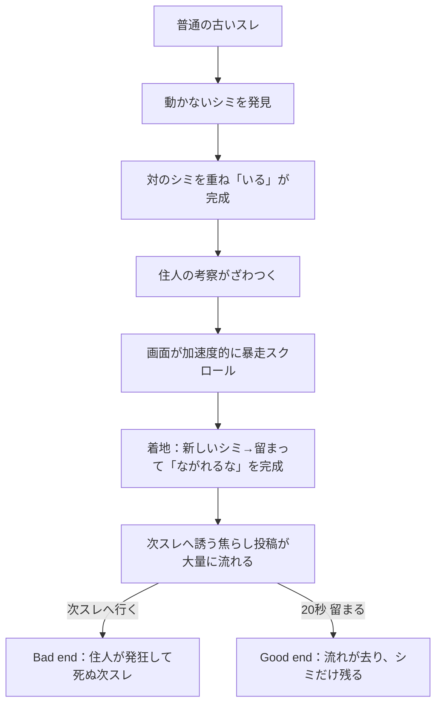

# 流れないスレ — 体験設計

この文書が `still-thread` の演出・体験仕様の正である。実装（`index.html`）と本書が食い違う場合は、実装を本書に合わせるか、本書を実装に合わせて更新する。新しい変更は末尾へ差分を継ぎ足さず、該当節を更新する。

## 1. 作品の核

> このスレは、深入りした者を食べ、取り込んだ者を住民にして次の誰かを誘わせる。

舞台は一見ありふれた匿名掲示板である。画面に貼りついた黒いシミだけがスクロールへ従わない。プレイヤーはそれを汚れや表示不良だと思うが、投稿が流されるほど、その異物だけが変わらず残る。

怪異は「深入りさせ、次へ進ませること」にある。掲示板は投稿を流し、すでに取り込まれた住民は孤独や嫉妬に押されてプレイヤーを次スレへ誘う。流れに乗って次スレへ行けば、プレイヤーもスレに食べられ、その一部になる。流れに逆らい、深入りせずに留まった者だけが抜けられる。

この原理は進行中に説明しない。クリア後にだけ、プレイヤーが取り込まれずに済んだ理由として真相を開示する。

## 2. 演出原則

### 平常から始める

冒頭は「ホラー作品のタイトル画面」ではなく、誰かが共有した古いスレを開く感触にする。赤い発光、墨文字、強いヴィネットなど、開始前から怪異を約束する装飾は使わない。違和感はシミ一つから始める。

### 答えは言わせる／解き方は言わせない

住人は現象に戸惑い、考察し、やがて発狂する。ここは掲示板であり、住人が反応しないほうが不自然だからだ。ただし次の「解き方」は最後まで言わせない。

- シミを重ねれば文字になると教える（＝解き方）
- 長押しや静止待機を直接指示する（＝解き方）

一方、次は積極的に描く。

- 「いる」に変わったことへの戸惑い・考察（結果への反応）
- 勝手にスクロールが流れ出す恐怖の共有（体験の実況）
- 次スレへ行きたくさせる焦らし（誘導＝罠）

怪異の「実況係」にはしないが、「解けたと錯覚した群衆」にはする。群衆の親しみと共感が、そのまま次スレへの誘い（罠）に反転する。

### 固有の恐怖を優先する

中心となる視覚言語は、固定されたシミ、流れる投稿、止まったあとの空白である。汎用的な赤フラッシュや無意味な画面揺れを多用しない。文字化け・崩壊表現は、次スレ（バッドエンド）の「発狂して死ぬ」段階に集中させ、本編では抑制する。

## 3. 恐怖曲線



恐怖は段階的なフィルター追加ではなく、プレイヤーとスクロールの関係が変わることで強める。信用 → 違和感 → 考察のざわつき → 制御喪失（暴走） → 抵抗と静止 → 誘惑 → 留まる/呑まれる。

## 4. 体験フロー

### 4.1 導入（intro）

- CTAは中立的な「続きを読む」程度とし、赤く発光させない。
- 背景・書体・ヘッダーは実在しそうな匿名掲示板へ寄せる。無音で始める。
- シミは字形として判別不能な不定形で、初見では汚れ・圧縮ノイズ・表示不良のいずれにも読める。

### 4.2 読む／シミを重ねる（practice）

- 上部に貼りつく固定シミ（左片割れ）と、スレを流れてくる対のシミ（右片割れ）がある。
- プレイヤーがスクロールで両者を重ね、そこで静止すると2秒で「いる」が完成する。
- 気づきにくさは一段高め、一目では解けないが理不尽ではない程度に吸着・許容を調整する（`TOL_PRACTICE` / `SNAP_PRACTICE`）。
- 詰み救済は段階的後出し：静止で近接脈動→高速通過が続けば体感ヒント→長時間未完成で反転ヒント→最下部で手詰まりなら練習帯へ穏やかに引き戻す。

### 4.3 考察（beat A）

- 「いる」完成直後、住人の考察が新着として、間隔を詰めながら約6.5秒湧く。
- 内容は「二つの汚れが重なって『いる』になってる」「いる、って何が」という戸惑いと、「さっきから画面が下に動いてない？」という次段への導線。
- 解き方（どう重ねたか）は言わせない。あくまで結果への反応にとどめる。

### 4.4 暴走スクロール（pull）

- ある地点でスクロールが下方向へ加速度的に暴走する（体感で約9〜12画面分）。
- **暴走中も、流れていく住人のパニック投稿が読めること**を要件とする。前半はゆっくり読める速度に保ち（`PULL_ACCEL_FRAC` を長めに、`PULL_MAX_BLUR` を低く）、後半で一気に加速させる。読ませたいパニック投稿（「みんなもそうなってる？」「めちゃくちゃ流されてる。超怖いんだけど」等）は読める前半と、着地して静止する減速域に置く。
- 暴走中は長押し等で抵抗でき、抵抗すればその場で止まる。抵抗の有無に関わらず遊べる位置へ着地する。
- 累積の高速フリックが過大な場合のみ、別系統のホラー段階（`flowAccum`）が進み、無視し続けると次スレへ呑まれる。止まれば必ず減衰する。

### 4.5 新しいシミ／留まる（main）

- 着地すると、さらに下に新しいシミ（右片割れ）が現れる。
- ドリフト（怪異が流す）に逆らって整列位置で長押し静止すると2秒で「ながれるな」が完成する。
- 住人は新しい記号に戸惑うが、何と書いてあるかは言わせない（「それは読まないほうがいい」という予感だけ）。

### 4.6 誘導と選択（choice）

- 完成後、「次スレへ ▶」の囮ボタンが浮上し、次スレを見に行かせる焦らし投稿が間隔を詰めて大量に流れる（「見てきたけどやばい」「絶対見に行った方がいい」「全部わかった。ネタバレになるから黙っとくけど見に行った方がいい」「こっちみんないるよ」等）。
- ここが分岐点。ボタンを押す＝流れに乗る＝**Bad end**。押さずに20秒留まる（動かない）＝見に行かない＝**Good end**。
- 待機中、13秒までは焦らし投稿を読める明るさで保ち、以降スレが静かに引いていく（流れが去る表現）。囮ボタンも徐々に褪せる。

### 4.7 エンディング

- **Good end（clear）**: 流れる投稿が水のように引いて消え、固定されていたシミだけが残る。見出しは**「脱出成功」**。「新着は、もう来ない。／画面のシミだけが残っている。」の余韻に続き、**真相開示エピローグ**を1行ずつフェードインで見せる。内容は「このスレは、深入りした者を食べてしまう」「住民はみんな、食べられて、もうその一部になっている」「孤独や嫉妬に押されて、次の誰かを取り込もうとしていた」「あなたは、深入りしなかった。流されなかった」「だから、取り込まれずに済んだ」——怪異の正体、住民が誘う理由、プレイヤーが助かった理由を明かす。
- **公演CTA（外部導線）**: エピローグを読み終えてから、余韻を置いて（最終行の約3.6秒後）フェードインで出す。真相を読んでいる最中には出さない。
- **Bad end（nextthread）**: 実際に次スレが開いたように遷移する。冒頭は会話が成立しているが（安心させる）、住人が徐々に→加速度的に発狂して死んでいく。全員が同じ一文を反復し、投稿者名が「あなた」に変わり、文体が崩壊（誤字・ひらがな化・分かち書き・句読点消失）、レス間隔が異常に詰まり、連投し、書き込みが途中で途切れ、警告「ながれるな」が「ながれろ」へ意味反転し、文字化けの複製が加速して湧く。最後に全て流れ去る。
- **バッドエンドの大見出し**: 全バッドエンドルート（囮ボタン=decoy／誘いに応じた=dialog／流されすぎ=flow）は同じ末路画面に合流する。そこで**一目で「バッドエンド」と分かる大きな見出し（「BAD END／バッドエンド」）**を最優先の視認性で表示する。演出は世界観に合わせ、にじんだ汚れから血文字が染み出て浮かぶ（inkBloom と同じ文法）＋ごく低頻度・低振幅の明滅ノイズに留め、可読性を損なわない。その下に「あなたも、ながれていった。」の一文を添える。

## 5. 投稿設計

投稿は流れごとに役割を持つ。

| 区間 | 役割 | 目安 |
|---|---|---:|
| 導入 (1〜7) | 板を信用させ、固定シミへの気づきを作る。綻び(.seam)で「作り物」の伏線 | 7件 |
| 考察 (beat A) | 「いる」への戸惑いと、暴走への導線 | 7件 |
| 暴走 (pull) | 制御喪失のパニックを実況（読める前半＋着地の減速域） | 8件 |
| 新シミ (beat B) | 新しい記号への戸惑いと「読むな」の予感 | 4件 |
| 誘導 (beat C) | 次スレへ行きたくさせる焦らしを加速して流す（罠） | 10件 |
| 次スレ (bad end) | 発狂して死ぬ住人。文体崩壊・連投・途切れ・意味反転 | 自動生成 |

「重ねろ」「合わせろ」「長押ししろ」といった解き方の直接指示は住人に言わせない。「いる」「ながれるな」を住人に音読させて答え合わせにしない（次スレのバッドエンドで崩壊語として反復するのは可）。

## 6. シミの視覚設計と結合演出

- 結合ギミックは「固定側のシミ（左片割れ）」と「流れてくる対のシミ（右片割れ）」の二つで成り立つ。**両者とも未完成時はひらがなに読めない不定形の汚れに見せる**（片方だけ半文字を露出させて答えを漏らさない）。
- 不定形は、実文字へ強いブラーと決定論的な微小歪み（回転・スケール）を掛けて作る。歪みは完全ランダムではなく添字シードで決まり、固定側と流れ側で同一シードを使う。ゆえに正しく重なると同形の左右片が噛み合い、**「この二つのシミが一文字だった」必然性が事後に分かる**（理不尽にしない）。
- 位置ヒント・近接脈動・引き戻し等の既存救済は維持する。近接時はブラーを残したままにじみ光だけ強め、「重なりかけ」を示すが答えは割らない。
- **正しく重なった瞬間、インクが染み出して文字が浮かぶ演出（inkBloom）**を入れる。強ブラーの汚れ → にじみが収束して一度明滅 → 鮮明な墨字へ収束。流れ側の片割れは固定側へ吸い込まれるように少しにじんで消える（二つが一つに融ける）。派手なパーティクルは使わず「染み出す」系に寄せる。
- この演出は練習の「いる」・本編の「ながれるな」など、**全てのシミ結合箇所へ一貫して適用**する。
- 怪異化のために色を赤へ変えない。最後まで同じ黒さでいることが不気味さになる。
- コアギミック（シミ／文字／流れ）のモチーフを全画面へ控えめに散りばめ、クリアで回収される感覚を作る。
- `prefers-reduced-motion` では inkBloom を再生せず、汚れから鮮明な文字へ即時に収束させる（ブラー自体は視覚概念のため維持）。

## 7. 無音

全編を意図的な無音とする。BGM、環境音、スクロール音、新着tick、ジャンプスケア音、端末の触覚（抵抗時の軽い振動を除く）を追加しない。匿名掲示板は本来、読む人の端末内で黙って存在する媒体である。怪異も同じ無音のまま画面の支配だけを奪う。

## 8. アクセシビリティ

- `prefers-reduced-motion` では暴走スクロールを長距離高速再生せず、演出をほぼカット（短時間・低移動）へ置換する。次スレの崩壊シーケンスも揺れ・強フィルタを外し、進行ロジックだけ維持する。
- 画面揺れ、背景水流、ブラーは reduced で無効または最小化する。
- 進行状態はスクリーンリーダーへ通知するが、解き方を先に読み上げない。
- タップ対象は44px以上。キーボードでも抵抗入力・長押し・再試行ができる。
- `visualViewport` の高さとoffsetを反映し、アプリ内ブラウザのバー伸縮をプレイヤー入力として誤判定しない。暴走距離は `window.innerHeight` から算出し端末差を吸収する。

## 9. 状態モデル

```text
title -> practice -> (beat A) -> main[pull -> hold] -> choice
                                                         |  \
                                                         |   -> nextthread(bad end)
                                                         -> clear(good end, 20s stay)
```

- `practice`: 通常スクロール。2つのシミを重ね静止で「いる」完成。
- `main`: 暴走スクロール（pulling）→ 着地 → ドリフトに抗して長押しで「ながれるな」完成。
- `choice`: 焦らし投稿を流しつつ、囮ボタン（=流れる）と20秒静止（=留まる）の分岐。
- `clear`: 説明なしの成功余韻。
- `nextthread`: 発狂して死ぬ次スレのバッドエンド。終幕で `#badend-screen` を表示。

## 10. 計測

計測は演出から独立させ、同一遷移につき一回だけ送る。

| イベント | 発火条件 |
|---|---|
| `game_start` | スレを開いたとき |
| `fragment_align` | 「いる」が完成したとき |
| `main_pull_start` / `main_pull_settled` | 暴走スクロールの開始／着地 |
| `stay_proven` | 「ながれるな」を長押し静止で完成したとき |
| `stay_begin` | 誘導フェーズで静止タイマーが始動したとき |
| `game_clear` | 20秒留まってGood endへ入ったとき（`method`, `waitedMs`） |
| `bad_end` | 次スレへ行った／流されすぎた（`route`, `flowAccum`） |

見るべきは、暴走に抵抗できた割合、誘惑に耐えて留まれた割合、到達時間。

## 11. 受け入れ条件

1. 開始画面だけを見てホラーの答えや墨文字を予測できない。
2. 2つのシミを重ねて「いる」を完成でき、その解き方は住人が説明しない。
3. 「いる」完成後に考察の会話が読める間隔で湧く。
4. 暴走スクロールが加速度的で、かつ**流れる住人のパニック投稿が読める**（少なくとも前半と着地時）。
5. 着地後に新しいシミが現れ、留まって（長押し静止で）「ながれるな」を完成できる。
6. 誘導フェーズで焦らし投稿が大量に流れ、「次スレへ」ボタンが常に押せる。
7. 20秒留まるとGood endへ入る。「次スレへ」を押すとBad endへ入る。
8. Bad endの次スレは冒頭の横幅崩れがなく、住人が加速度的に発狂して死ぬ（文体崩壊・連投・途切れ・意味反転）。「来たね来た来た」のような軽いノリがない。
9. 全バッドエンドルートで「BAD END／バッドエンド」の大見出しが一目で分かる視認性で表示される。
10. Good endでは余韻の後に真相開示エピローグが1行ずつ出て、シミ＝文字＝流れの怪異が回収される。公演CTAはエピローグを読み終えてから余韻を置いて出る（読中には出ない）。
11. ヒントは詰まった後に段階的後出しで、UIに操作指示や答えを常時表示しない。
12. 全編が無音で成立する。
13. reduced-motionで暴走スクロールが長距離高速再生されない（エピローグ／大見出しの演出も即時収束で可読）。
14. 主要viewportで進行不能・画面外演出・JavaScript例外がない。

## 12. スコープ外

- 真相開示エピローグを、余韻のない説明口調の教訓・攻略解説にすること（開示はするが、断定的な講釈にしない）。
- Bad endだけを豪華にしてGood endを地味な説明カードにする非対称（Good endにも真相回収の見せ場を置く）。
- 解き方（重ね方・長押し・待機）の住人による直接指示。
- 効果音・BGMで恐怖を補う変更。
- 本編（次スレ以外）での過剰な文字化け・赤フラッシュの多用。

新しい演出案は「固定された異物」「制御を奪う流れ」「留まる選択と呑まれる選択の対比」のいずれかを強める場合だけ採用する。
