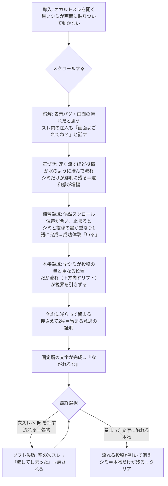

# 流れないスレ（still-thread）企画

> Web謎 企画ドキュメント。設計まで。実装は `auto-dev` 等の別工程に渡す。
> 公開想定 URL: https://games.escape-safari.com/still-thread/

## 結論

オカルトスレをスクロールしても、画面に貼りついて動かない黒い「シミ」がある。プレイヤーは表示バグ・画面の汚れだと誤解する。だが**速く流すほど投稿は水のように滲んで流れ、シミだけが鮮明に残る**——動かないものこそが本物だと気づく。スクロール位置を合わせて流れに逆らって**留まる**と、シミは墨字として完成し「ながれるな」という言葉になる。最後、スレ末尾の「次スレへ ▶」（流れて先へ行く誘い＝偽物）を押さずに、**留まった文字に触れる**とクリア。回収の一文は「流れるものは偽物で、留まるものだけが本物である」。プレイヤーが最初から無意識にやっていた「スクロール（流す）」という行為そのものが、怪異の狙いだったと反転する。

## 背景

- 新事業「Web謎解き（低単価）」向けの単発Web謎。X投稿リンクからXアプリ内ブラウザで遊ばれる想定。
- 舞台は既存世界観の **SAFARI／オカルトスレッド**。イッチ・凸ニキ・超絶ジジイ・怪異好きオネーサンが住人として既にいる 2ch風スレッドの延長線上に置く（新規設定は増やさない）。
- コア動詞は **スクロール（流す／留まる）**。Web謎の主媒体である「縦スクロールする掲示板スレッド」そのものの性質——投稿が流れ去り、スレは次スレへ置き換わり、オカルトスレは消えていく——を謎の芯にする。媒体の宿命を謎の必然に変換する狙い。
- 規模は3〜5分・3人チームで回る最小物量。センサー（傾き）を使わずスクロールだけで成立させ、権限ダイアログも不要にする（zoo-escapeより実装・素材ともに軽い）。

## 世界観の核

**核（1文）**:
> このスレッドという怪異においては、流れるもの（スクロールで過ぎ去る投稿・次スレへの誘い）はすべて偽物で、流れに逆らって留まるもの（画面に貼りついたシミ＝文字）だけが本物である。

この1文から全要素を導出する。導出できない要素は足さない。

**三つの必然**:
- **ギミックの必然（なぜこの世界でスクロール／留まるが意味を持つか）**: オカルトスレは「流れて消える」ことで存在する怪異。過ぎ去る投稿の中に本体は無い。怪異の本当の言葉は「流れに逆らって留まっているもの」にしか宿らない。だから真意を読むには、媒体が最も嫌う行為＝流れを止めて留まる必要がある。スクロールは媒体の本性、留まることは本性への反抗。
- **行動の必然（なぜ最終行動＝次スレへ流されない、がゴールになるか）**: この怪異は人を「次スレへ、次スレへ」と流し続けることで留め置く（永遠にスクロールさせ続ける）。流れを拒み、留まった本物に触れることだけがループを断つ＝クリア。
- **遠回りの必然（詰まってスクロールする時間に意味があるか）**: 詰まって答えを探すほどプレイヤーはスクロールする。だが速く流すほど投稿は滲んで溶け、鮮明なまま残るシミだけが相対的に浮かび上がる。**プレイヤーの困惑（スクロール）が、そのまま本物を炙り出す**。怪異はプレイヤーを流し続けたい（＝留めたい）が、その流し行為が皮肉にも真実を露わにする。遠回りが体験の一部になる。

**恣意パラメータの物語化**:
- **位置合わせ後の保持2秒＝「留まる意思の証明」**: 一瞬の一致は偶然。流れ（ドリフト）に逆らって2秒留まることは「自分は流されない」という意思の証明。怪異は、流れに抗える者にだけ本当の顔を見せる。
- **スクロール速度で投稿が滲む閾値**: 流れているものは形を保てない（偽物だから）。速度が0に落ちて初めて形が定まる。
- **シミの数＝完成語の文字数**（例: 4）。物語上の追加意味は与えず、これ以上の理由付けはしない（複雑化しない）。

**例外の設計**（法則に従わない存在を意図して1つ置く）:
- **先人の固定投稿**: スレ中ほどに、他の投稿と違って**流れず・滲まず、シミのように画面に固定されたまま**の投稿が一つだけある。以前この怪異に遭い、流れずに留まることを選んだ先人の書き込み（内容は「それは よごれじゃない」等、断定はしない断片）。原理（流れる＝偽物／留まる＝本物）を体現する唯一の「留まった人間」であり、それ自体が無言の語りになる。zoo-escapeで確立した「クリアした者が先人になる」パターンと地続き（クリア後、その固定投稿がプレイヤー自身の一筆に増える演出は将来拡張として保留）。

**説明の所在**: この核はドキュメント／READMEにのみ全文記録し、ゲーム内では各画面1文以内の含みに留める（説明口調・ヒント先出し禁止）。プレイヤーはクリア後に核を言い当てられなくてよい。体感で一貫していればよい。

## 体験フロー

導入→気づき→練習→本番→最終行動 の5段で、体感3〜5分。

## 画面構成

実体は**単一の縦スクロール空間（1本のスレッド）**＋数個のオーバーレイ状態。ページ遷移はほぼ無く、スクロール位置に応じて領域が切り替わる。Xアプリ内ブラウザ前提で、進行必須要素はすべて可視領域**上部70%（セーフゾーン）**に置く。

| # | 画面／領域 | 役割 | セーフゾーン上の扱い |
|---|-----------|------|----------------------|
| 1 | タイトル／導入オーバーレイ | スレを開く。導入1文「画面に、動かない黒い点がある。」→「はじめる」 | 中央・上部70%内 |
| 2 | スレッド本体（縦スクロール） | 導入部・練習領域・先人の固定投稿・本番領域・フッターを内包する1本の連続空間 | 進行必須の墨・シミは上部70%内に配置 |
| 2a | 固定層（`position:fixed` のシミ4片） | スクロールに追従せず画面に貼りつく。常に鮮明。上部70%の定位置 | 常に上部70%内（visualViewport追従で再配置） |
| 2b | 練習領域 | 1〜2片のシミの下を補完墨が通過。止まると1語完成（成功体験） | 完成文字は上部70%内 |
| 2c | 本番領域 | 4片すべての補完墨が同時に重なる位置。下方向ドリフトあり | 完成文字・留まる対象は上部70%内 |
| 2d | フッター「次スレへ ▶」 | 流れて先へ行く誘い（囮）。本番完成後は上部70%へも浮上して選択を迫る | 囮のため下部可でも、選択時は上部70%に浮上 |
| 3 | 完成／クリア演出オーバーレイ | 流れる投稿が水のように引いて消え、シミ＝本物だけが残る。回収の一文 | 中央・上部70%内 |
| 4 | ソフト失敗オーバーレイ | 「次スレへ」を押した時。空の次スレ→「流してしまった」→本番へ戻す | 中央・上部70%内 |

**技術判断: Three.js は使わない。DOM/CSS ベースで実装する。** 本作の芯は「スクロールする掲示板スレッド」そのものであり、DOMの縦スクロール＋`position:fixed`の固定層＋スクロール速度に連動したCSSフィルタ（`filter: blur()`／`opacity`）で成立する。WebGLは不要で、その方が軽く・媒体に忠実で・3人チームで回る。単体HTML1ファイル＋画像少数、ビルド不要、静的配信。

**Xアプリ内ブラウザ実装要件**（`threejs-single-file-game` SKILL「セーフゾーン実装」に準拠。3Dでなくとも同じ原則を適用）:
- `100vh` 不使用。`100dvh` を基本にJS計測フォールバック（`window.innerHeight`→CSS変数）。
- `window.visualViewport` の `resize`／`scroll` を監視し、固定層シミの位置を毎回再計算（`position:fixed` はXアプリ内ブラウザでURLバー伸縮時にズレるため、JSで `visualViewport.offsetTop/height` を用いて固定層を translate 補正する）。
- 進行必須（シミ・補完墨・完成文字・留まる対象・先人の固定投稿）は上部70%内。下部25〜30%は囮の「次スレへ」以外の進行必須物を置かない。
- `env(safe-area-inset-bottom)` を下部余白に算入。本番完成時に浮上する「次スレへ」囮と「留まった文字」は互いを覆わないよう左右／上下に分けて配置（自前オーバーレイでの occlusion を作らない）。
- サポート最小ビューポート縦600px（390×600・852×600）で成立を実装完了基準にする。

## ギミック仕様

### コアギミック: スクロールで位置合わせ → 留まって完成

1. **固定層（シミ）**: 画面上部70%の定位置に半透明の墨のシミ4片を `position:fixed` で置く。各片は仮名1文字の**不完全なストローク（片割れ）**。スクロールしても動かず常に鮮明。初見は「表示バグ・汚れ」に見える。
2. **補完墨（流れる側）**: スクロールする投稿群の中に、各シミの**補完ストローク（もう片割れ）**が仕込まれている。特定のスクロール位置でだけ、補完墨がシミの真下に来て**2つの片割れが1文字に完成**する。大半の位置では重ならず、シミはノイズに見える（誤解の維持）。
3. **完成判定**: `scrollTop` を監視。補完墨の目標位置（スクロール量）とシミ固定位置の重なりが許容誤差内、**かつスクロールが静止（`scrollTop` が300ms以上安定）**したら、その片の blur が晴れ、2片が鮮明な墨字に結合して微かに発光。
4. **速度連動の世界反応（コア動詞への微反応・必須要件）**:
   - **速く流す**: 投稿群に縦方向モーションブラー＋わずかな脱色を掛け（`filter: blur()` を `scrollVelocity` に比例）、背景に下方向へ流れる水流の微テクスチャを重ねる。**シミは一切ブラーしない**（流れないから）。→ 流すほどシミだけが際立つ（遠回りの必然の視覚化）。
   - **止まる**: 投稿が鮮明に定まり、環境音が静まる。近傍に完成目標があるシミは微かに脈動（発光）して「ここで留まれ」を無言で示唆。
5. **練習領域（気づき→成功体験・伏線）**: 1〜2片が完成する平易な地点。許容誤差を広く、ドリフト無し。止まるだけで自動的に2秒経過し完成。完成語は **「いる」**（居る／視てる、のオカルト的含み）。操作説明はしない——「止まると読める」という手触りだけを与える。**この操作は本番で『留まる＝本物を選ぶ』という別の意味で再利用される（伏線であって説明ではない）**。
6. **本番領域（留まる意思の証明）**: 4片すべてが同時に重なる唯一の位置。ここでは**下方向ドリフト（自動スクロール）が視界を引きずる**（怪異が流そうとする）。プレイヤーは流れに逆らって留まる必要がある。
   - **「留まる」ジェスチャ**: 位置が合った状態で**画面を押さえ続ける（press-and-hold）**とドリフトが止まり、押さえている間に**保持2秒**で完成。指を離す／スクロールが動くとタイマーはリセット（＝流された）。press-and-hold にすることで iOS の慣性スクロール・ラバーバンドの影響を避け、端末差に強くする。
   - 完成すると4文字が結合し **「ながれるな」** が浮かぶ。
7. **最終選択（回収）**: 「ながれるな」完成後、画面上部70%に2択が並ぶ:
   - **囮: 「次スレへ ▶」**（脈動して流れを促す。押すとソフト失敗）。
   - **本物: 留まって完成した文字（シミ）そのもの**（触れられる実体になる）。
   - **正解＝留まった文字に触れる**。流れる投稿群が水のように引いて消え、シミ＝本物だけが残る。回収の一文（後述）。「答えの文字列を入力」ではなく「流れる偽物か、留まる本物か、どちらに触れるかという行動」で決着する。

### 完成語の設計

| 領域 | 完成する語 | 役割 |
|------|-----------|------|
| 練習 | いる | オカルト的含み（誰かが居る／視ている）。操作の手触りを教える成功体験・伏線 |
| 本番 | ながれるな | 最終行動の指示。解いた後にだけ現れる「回収された言葉」＝そのまま次の行動になる |

補完墨・シミは**AI画像ではなくSVG／CSSクリップで実装推奨**（後述・素材リスト参照）。「ながれるな」を実文字として持ち、各字を固定側の片割れと流れる側の片割れに `clip-path` で分割する。ピクセル単位の一致をAI画像に頼らず担保でき、素材リスクと物量を大幅に削減できる。

### 回収の一文（クリア演出・各画面1文以内）

- 完成時: 「流れていたものは、みんな、うそだった。」
- 残ったシミへ: 「留まっていたものだけが、ほんとうだった。」
- 余韻: 「このスレも、いずれ流れて消える。——でも、あなたは留まった。」
（核「流れるものは偽物で、留まるものだけが本物」は説明せず、体感で閉じる。）

### ヒント仕様（先出し禁止・詰まった後だけ段階的に）

初期はUIに操作指示・答えを書かない。雰囲気テキストと住人の投稿だけで誤解を作り、詰まりを検知してから間接→直接で後出しする。失敗後フィードバックは可。

- **導入の雰囲気テキスト（1文のみ）**: 「画面に、動かない黒い点がある。ゴミ……？」——誤解（汚れ・バグ）をこちらから提示して固める。
- **住人の投稿による誤解の維持と揺さぶり**（操作指示ではなくフレーバー）:
  - 序盤: 凸ニキ「画面よごれてね？」超絶ジジイ「儂のにも黒い点があるぞ」——「みんなに見える汚れ」として正常化（誤解を強める）。
  - 先人の固定投稿（例外・流れず固定）: 「それは よごれじゃない」——断定も操作指示もしない、留まった者の断片。
- **段階的ヒント（詰み検知トリガー付き）**:
  1. 練習領域を高速スクロールで通過し続ける（速度が常に高いまま N 回通過）→ 間接ヒント: 「速く流すほど、あの点だけが、はっきりする。」（観察の提示。「止まれ」とは言わない）
  2. 一定時間（約40秒）どのシミも完成しない → 反転ヒント: 「点は動かない。動いているのは、こっちだ。」（"止まる"を示唆）
  3. 練習済みだが本番の位置合わせ＋保持ができない → やや直接: 「止まって、待ってみたら？ 流されないように。」
  4. 本番完成後に「次スレへ」を2回以上押す（ソフト失敗が重なる）→ 「次へ進むほど、遠ざかる。」（流れるな＝留まれの言い換え）
- **失敗後フィードバック（可）**:
  - 「次スレへ」を押した時: 「……流してしまった。」→ 空の次スレ（虚空）を一瞬見せて本番へ戻す。
  - 保持中に動いた／早く離した: 「途中で、また流れてしまった。」
- **代替操作の案内は失敗後に限定**: 慣性スクロールで「留まる」が難しい端末や、PC（マウスホイール／ドラッグでスクロール、press-and-hold＝マウス長押し）で複数回失敗した後にだけ、「長押しで、その場に留まれる」を後出しする。先出しで手順は教えない。

### 端末差・入力の担保（正解は制御・失敗しても次が分かる）

- **センサー不使用**: スクロールとタッチのみ。iOS の DeviceOrientation 権限ダイアログ不要（zoo-escapeより単純）。
- **慣性スクロール対策**: 完成判定は瞬間速度でなく静止判定（速度が `STILL_V` 未満）で行う。許容誤差を広めに取り、静止中は JS で目標位置へ穏やかに吸着（毎フレーム `window.scrollBy(0, err * 0.12)`。CSS `scroll-snap` は慣性・URLバー伸縮下で不安定なため採用せず、JS 吸着で代替した）させて「正しい位置で止まる」を達成する。留まるは press-and-hold なので慣性の影響を受けない。
- **結果がブレない**: 完成/未完成の二値。半端な保持は永続しない（離せば false に戻る）。読むべき文字（完成語・回収文）は完成後は常に鮮明（可読性保証）。
- **PC代替**: マウスホイール／ドラッグでスクロール、押しっぱなしで留まる。`?debug=1` でスクロール量・速度・各シミの完成状態を表示（ヘッドレス検証用）。

## 注意点・未確定点

- **3人チームで回るか**: ○想定。実装は単体HTML＋DOM/CSSのみ（WebGL・センサー・音声必須なし）。素材はAI画像2〜3枚に抑制（下記）。謎ロジックはスクロール量と重なり判定＋press-and-holdタイマーで、zoo-escapeの傾き物理より単純。
- **`position:fixed` × Xアプリ内ブラウザの実機挙動**が最大の実装リスク。URLバー伸縮・慣性スクロール中に固定層がジャンプする既知の癖があるため、`visualViewport` 追従の translate 補正を実装必須とし、実機（縦600px含む）で「シミが上部70%に留まりタップ可能」を検証する（`webgl-game-headless-verify` の縮小ビューポート確認に準拠）。
- **補完墨のピクセル一致**: AI画像で2枚の片割れを完全一致させるのは困難。**SVG／CSSクリップで実文字を分割する方式を推奨**（素材リスク回避）。AI画像方式を採る場合はシミと補完墨を1枚のスプライトから切り出す（同一原画から分割）こと。
- **本番ドリフトの強さ**は要調整の仮置き（強すぎると理不尽、弱すぎると「留まる意思」を体感できない）。テストプレイで詰める。
- **「留まって何もしない」勝利の分かりにくさ**は、勝利条件を「留まった文字に触れる」という能動タップにすることで回避済み（囮の次スレへ との二択）。ただし「囮を押さない＝正解」の気づきやすさはテストプレイ要確認。ヒント4で担保。
- **先人の固定投稿**の演出（流れない投稿の見せ方）が地味になりがち。周囲の投稿が滲んで流れる中でこれだけ鮮明＝固定、という対比を必ず付ける（静的配置だけでは装飾に終わる、を回避）。
- クリア後に先人投稿へ自分の一筆が増える拡張は**将来保留**（今回スコープ外・複雑化回避）。

## 次に作るもの

実装（`auto-dev` 等）に渡す優先順:

1. **スクロール空間の骨格**（最優先）: 1本の縦スクロールスレッド（DOM）、`position:fixed` 固定層4片、`visualViewport` 追従の固定層再配置、`100dvh`/セーフゾーン。→ 実機で固定層が上部70%に留まることを先に確定。
2. **速度連動フィルタ**: `scrollVelocity` に比例した投稿ブラー＋背景水流、静止で鮮明化。シミは非ブラー。
3. **完成判定＋SVG分割文字**: 「いる」「ながれるな」をSVG/CSSクリップで固定片割れ＋流れる片割れに分割し、`scrollTop` 重なり＋300ms安定で結合完成。
4. **練習→本番の領域配置**とドリフト＋press-and-hold保持2秒。
5. **最終選択（次スレへ囮／留まった文字）とクリア・ソフト失敗演出**、回収文。
6. **段階的ヒント（詰み検知）と失敗後フィードバック**、住人投稿テキスト。
7. GA4計測（`analytics.js` 流用、`GAME.id="still-thread"`）。イベント案: `game_start`／`fragment_align`（練習完成）／`stay_proven`（本番保持完成）／`decoy_tapped`（次スレへ押下＝ソフト失敗）／`game_clear`。
8. OGP・共有カード。

### 素材リスト（AI生成・最大6枚／実際は2〜3枚に抑制）

各画像は画像生成プロンプトが書ける粒度で記載。**謎の要のストローク（シミ・補完墨）はAI画像でなくSVG/CSSクリップ推奨のため、AI画像は雰囲気用に限定。**

| # | ファイル名（仮） | 内容 | スタイル | サイズ | 用途 | 必須度 |
|---|------------------|------|----------|--------|------|--------|
| 1 | `bg_thread.jpg` | 暗いオカルト掲示板の背景。ほぼ黒〜青灰、縦方向にごく微かな水流／流れる筋のテクスチャ。文字なし。縦タイル可 | フラット・脱色・不気味・情報量少 | 1080×1920 縦 | スクロール背景。CSSで水流アニメを重ねる土台 | 必須 |
| 2 | `sumi_ink.png` | 墨のにじみ／濡れたシミのシームレステクスチャ1枚。荒い濡れエッジ、チャコール黒、透過 | 墨・和・かすれ | 1024×1024 透過 | SVG/CSSクリップした文字を「きれいなテキスト」でなく本物のシミに見せるマスク素材 | 必須 |
| 3 | `ogp.jpg` | 滲んで流れる投稿の中に、鮮明な黒いシミが一つだけ貼りつくスレ画面。タグライン非表示 | 本編と同トンマナ・不穏 | 1200×630 | X共有カード | 必須 |
| 4 | `relic_post.png` | 先人の固定投稿カードの古びた質感（焦げ／染みエッジ）。透過 | 古い・墨染み | 600×200 透過 | 例外＝先人の固定投稿の背景（CSSで代替可なら省略） | 任意 |
| 5 | `avatars.png` | 住人（イッチ・凸ニキ・超絶ジジイ・怪異好きオネーサン）の2ch風アイコン最小セット | フラット・匿名的 | 512×128 スプライト | 投稿主表示（絵文字/CSSで代替可なら省略） | 任意 |

補完墨・シミの完成ストロークはSVG/CSS（＋`sumi_ink.png`マスク）で描画するため画像化しない。結果、実生成は必須3枚＋任意2枚で**最大5枚**、推奨は3枚。3人チームの物量に収まる。

---

## セルフレビュー通過記録

### Phase 2 — 6つの学びによるセルフレビュー

| # | 基準 | 判定 | 一言 |
|---|------|------|------|
| 1 | ギミックでなく最初の違和感から作る | ○ | 起点は「動かないシミ」という違和感。スクロール操作は後付けの仕様として付く |
| 2 | チュートリアルは説明でなく伏線 | ○ | 練習の「止まると読める」は、本番で「留まる＝本物を選ぶ」という別の意味に転じる。操作説明はしない |
| 3 | 複雑な理由を足しすぎない | ○ | 設定は既存世界観の流用のみ。核は1文。シミ数の追加理由等は足さない。1画面（1スレ）で完結 |
| 4 | 正解は文字列でなく行動 | ○ | 入力ではなく「流れる囮か留まる本物か、どちらに触れるか」の行動で決着。世界（投稿）が引いて消える反応あり |
| 5 | 物理/入力は手触りに、結果は制御 | ○ | センサー不使用。press-and-hold＋JS吸着（静止スナップ）で端末差を吸収。完成は二値、可読性保証、失敗後フィードバックあり |
| 6 | LLMには案出しより先に判断軸 | ○ | 本設計も弱点指摘→成立条件→削る→画面仕様の順で実施。皮だけ世界観の懸念をPhase2.5で潰した |

### Phase 2.5 — 世界観との融合（6ステップ）

| ステップ | 判定 | 一言 |
|----------|------|------|
| 1 差し替えテスト | ○ | 学校の掲示板等では「流れ／次スレ」が無く成立しない。スクロールする掲示板スレッド固有に癒着させた |
| 2 三つの必然 | ○ | ギミック＝流れる媒体で留まる反抗、行動＝流されず留まりループを断つ、遠回り＝流すほど本物が炙り出る |
| 3 恣意パラメータの物語化 | ○ | 保持2秒＝留まる意思の証明。滲み閾値＝流れる偽物は形を保てない |
| 4 単一原理への収束 | ○ | 「流れるものは偽物、留まるものだけが本物」の1文に全要素を収束。導出外は不採用 |
| 5 例外の設計 | ○ | 例外＝流れない先人の固定投稿（留まることを選んだ唯一の人間） |
| 6 説明の所在 | ○ | 核はドキュメントに全文、ゲーム内は各画面1文以内の含みに留める |

### Phase 4 — 最終チェックリスト（16項目）

| # | 項目 | 判定 | 一言 |
|---|------|------|------|
| 1 | 最初に見せる違和感がある | ○ | 動かない黒いシミ |
| 2 | その時点ではすぐ解けない | ○ | 汚れ・バグと誤解し、完成条件（止まる位置＋留まる）は初見で不明 |
| 3 | 別場面で操作・見方を自然に覚える | ○ | 練習領域で「止まると読める」を成功体験として習得 |
| 4 | 違和感へ戻る理由がある | ○ | 速く流すほどシミだけ鮮明→シミへ意識が戻る。本番でシミが最終語になる |
| 5 | 操作で情報の意味が変わる | ○ | スクロール位置＋静止でノイズが墨字に変わる |
| 6 | 答えが次の行動になる | ○ | 完成語「ながれるな」が最終行動（流れず留まった文字に触れる）の指示 |
| 7 | 余計な設定を足していない | ○ | 既存世界観流用、核1文、追加理由なし |
| 8 | 失敗時の反応がある | ○ | 「流してしまった」「途中で流れてしまった」等 |
| 9 | センサー・端末差への代替がある | ○ | センサー不使用。press-and-hold＋JS吸着（静止スナップ）＋PC代替（長押し案内は失敗後のみ） |
| 10 | 最後に「最初からヒントだった」と分かる | ○ | 無意識のスクロール（流す）こそ怪異の狙い、シミこそ本物、と反転回収 |
| 11 | テーマ差し替えで成立してしまわない | ○ | 差し替えテスト済み。流れる掲示板スレッド固有 |
| 12 | 世界の核が1文で書け全要素を導出できる | ○ | 記載済み |
| 13 | 数値仕様に世界内の意味が付く | ○ | 保持2秒＝留まる意思の証明 等 |
| 14 | 例外が意図して設計されている | ○ | 流れない先人の固定投稿 |
| 15 | 進行必須が上部70%（セーフゾーン）に収まる | ○ | シミ・墨・完成文字・留まる対象・先人投稿を上部70%に配置。下部は囮のみ |
| 16 | 進行必須が自前の固定パネル等にも隠れない | ○ | 最終2択は囮と本物を分離配置し互いを覆わない。閉じられない恒常パネルを進行必須物の上に置かない |

**△以下の項目: なし（16/16 ○）。** 最大の実装リスクは項目15に関わる `position:fixed` × Xアプリ内ブラウザの実機挙動で、`visualViewport`追従の固定層補正を実装必須・実機検証必須として「注意点」に明記した。

---

## v2 拡張仕様（2026-07-12）

実装・レビュー・デプロイ済みの現行 `index.html` を正とした**差分仕様**。ユーザーからの3件の要望を、世界の核「流れるものは偽物で、留まるものだけが本物である」との整合を最優先し、Phase 2「足さずに削る」原則で過剰化を防いで仕様化する。既存資産（先人の固定投稿 `.post.relic`／post 9「日付が無いぞ」／速度連動ブラー `--flow-blur`／本番ドリフト `DRIFT`／吸着除外 `lastSnap`／ソフト失敗 `#softfail-screen`）を再利用し、新規要素は最小に留める。

### 現行実装の実態（DESIGN.md初版からの変更点・前提）

- 完成語: 練習 `WORDS.practice=いる` ／ 本番 `WORDS.main=ながれるな`。
- 本番の「留まる」は press-and-hold（`state.pressing`）＋整列＋静止で `HOLD_TARGET=2000ms`。scroll-snap は使わず **JS吸着** `snapBy()`（吸着量は `lastSnap` で速度計算から除外）。
- 本番ドリフトは一方向でなく **判定ゾーン ±`BAND=TOL_MAIN*3` を挟んで往復**（`state.driftDir`）。行き止まりを作らず整列窓を周期再訪させる。`DRIFT=32px/s`（reduced-motionで0）。
- 詰み検知ヒント: 高速通過3回 `fast`／練習22秒 `invert`／本番22秒 `mainHelp`／**整列窓ミス2回 or 40秒で長押しヒント** `holdHint`。
- 偽終端: 本番未完成で最下部到達時に住人レス no.13「まだ、流れてないやつがいる。」を1回追記＋フッター脈動 `restless`。
- 既存GA4: `game_start` / `fragment_align` / `stay_proven` / `decoy_tapped` / `game_clear`。
- 現状、本番のドリフト概念を予告する **post 11「なんか下に引っぱられる。勝手にスクロールしてる？」／ post 12「止まれない。ずっと次へ、次へ、行かされてる」が初期DOMに固定表示**されている（← v2-1で段階開示化する対象）。

---

### v2-1 段階開示（本番投稿の新着化）

**要望**: 初期スレに本番（ながれるな＝勝手にスクロール／次へ次へ）関連の投稿が最初から見えている。「いる」完成までは本番関連投稿を出さず、完成を契機に**新着としてスレに現れる**形にする。

**対象**: post 11・post 12 の2件のみ（本番のドリフト＝流される概念を先見せしている）。post 10「速く流すほど、点だけ、はっきりしてくる……」は練習／シミに関する気配なので**残す**（本番関連ではない・削らない）。偽終端 no.13 は現状どおり本番未完成時の動的追記のまま。

**変更（実装粒度）**:
- HTML: 該当2 `<article>` に `class="post deferred"` と `hidden` を付与し初期非表示。
- `enterMain()` 内で `revealDeferredPosts()` を呼ぶ:
  - `.deferred` の `hidden` を外し、`.arrive`（`opacity 0→1`＋`translateY(8px)→0` の一度きり、`prefers-reduced-motion` では即時表示）を付与。
  - `.thread-head` に「新着 2」を1.5s だけ差し込む（2ch的な小バッジ。テキストは既存の11/12を変えない）。
- 契機は **`practiceDone`（＝「いる」完成→`enterMain`）一択**。スクロール位置依存にしない（誤爆防止）。

**核整合**: 「いる（＝一度留まれた）」を成立させて初めて、スレが本性（次へ次へ流す、という告白）を見せる。**留まった者にだけ本物＝スレの真の姿が現れる**という段階開示そのものが核の演出になり、差し替え不能性を高める。既存フローは一切壊さない（表示タイミングの変更のみ）。

**GA4**: 追加不要（`stay_proven` 直前の `enterMain` で発火済み）。任意で `posts_revealed` を足してもよいが優先度低。

**追記（2026-07-12 拡張）**: 「いる」完成直後は本番予告（post 15・16、旧11・12）の前に、**「いる」という言葉自体への住人の反応・考察を3件**挟む（post 11〜13。誰が/何が「いる」のかは断定しない含みに留め、答え・操作指示は書かない）。さらに「ながれるな」完成直後（`enterChoice()` 契機）にも**完成語への反応を2件**（post 18・19。「次スレ＝流れる」への疑念を漂わせる範囲に留め、最終二択の正解は指示しない）を新着として追加した。いずれも既存の新着演出（`.arrive` フェードイン＋`.thread-head` の「新着N」バッジ）に相乗りし、進行必須要素ではないため配置は自由。`revealDeferredPosts(group)` を `data-reveal="iru"|"choice"` で振り分け、`enterMain()`／`enterChoice()` それぞれの契機で呼ぶ。追加分は合計5件（いる関連3＋ながれるな関連2）で、3〜5分規模を守る。

---

### v2-2 ホラー段階演出＋バッドエンド

**要望**: スクロールしすぎ（＝流され続ける）と投稿が不穏化→意味不明化し、最終的にプレイヤー自身も発狂・死亡するバッドエンド。核との整合＝「流された者の末路」。

#### (a) 計測: 累積フロー量 `flowAccum`（ユーザーの高速フリックだけを積む）

段階・死は**進行度と無関係**に、プレイヤーが「流れに身を任せ続けた総量」で決まる。新規 state: `flowAccum=0`, `horrorStage=0`, `stillHoldMs=0`。`loop()` 内で:

- **加算**: `state.velocity > FLOW_V(=650)` かつ `!state.pressing` のとき `flowAccum += Math.abs(userDelta)`。`userDelta` は既存の `(y-lastY) - lastSnap`（吸着除外済み）を使う。
- **減衰（救済の芯）**: `state.still`（`velocity < STILL_V`）が連続 `STILL_HOLD(1200ms)` を超えたら毎フレーム `flowAccum = Math.max(0, flowAccum*0.985 - 8)`。→ **止まれば必ず減る**。練習・本番は必ず「止まって完成」させるので、攻略している限り段階は上がらない。
- **除外**: `enterMain/enterChoice/backFromSoftfail` の `window.scrollTo`（大ジャンプ）とドリフトの `scrollBy` は加算対象外。ドリフトは `32px/s` で `FLOW_V=650` に遠く届かないため加算条件で自動除外されるが、大ジャンプ直後は1フレーム `programmaticFrame` フラグで確実にスキップする。
- **凍結**: `phase==="choice"|"clear"|"softfail"` および `mainDone` 後は計測停止（本物に到達済み）。

#### (b) 3段階・閾値・前兆・救済

閾値は px（初期値・要テストプレイ調整）。各段階は `#thread` へのCSSフィルタ（新規 `data-horror="1|2|3"`）と投稿演出で表す。

| 段階 | 閾値 `flowAccum` | 投稿トーン | 視覚演出（`#thread`／背景） |
|------|------------------|-----------|------------------------------|
| 1 不穏 | `FLOW_S1=14000` | 不穏な新着1件「…なんか、後ろにいない？」 | `saturate(.85)`＋ブラー下限+0.5px＋薄いvignette。whisperは出さず気配のみ |
| 2 崩れ | `FLOW_S2=26000` | 意味不明な新着1〜2件「■■がながれてくる」「たすけ」。既存postの一部を `corruptText()` で伏字・文字化け化（**本物post〈v2-3〉は対象外**） | `saturate(.6)`＋微hue回転＋グレイン＋濃vignette＋水流最大化 |
| 3 臨界（前兆） | `FLOW_S3=38000` | 既存postがほぼ判読不能。whisper前兆「流されている。……もう、戻れないかもしれない。」 | 下方向へ強く引かれる感覚（`#thread` にCSS縦揺れ transform）＋赤みvignette |

- **前兆＝救済ポイント（理不尽即死の回避）**: 段階3に入った状態で `state.still` を `STILL_SAVE(1500ms)` 維持すると `horrorStage` を2へ戻し `flowAccum` を `FLOW_S2` 直下へ引き下げる。救済発火時 whisper「……止まった。まだ、間に合う。」→ **留まれば助かる**を体験で示す（核と一致）。
- **バッドエンド**: 段階3到達後さらに流し続け `flowAccum >= FLOW_DEAD(=46000)` で `badEnd()`。段階3の前兆＋救済を無視して流し切った場合にのみ到達＝行動の帰結として納得できる。

#### (c) バッドエンド画面・文言（説明口調禁止・含み）・リトライ

- 演出: `#thread` 全投稿が一斉に下へ吸い込まれ流れ落ちる（既存 `--flow-fade=1` ＋ `translateY` 大）→暗転。
- 新規オーバーレイ `#badend-screen`（`#softfail-screen` と同型・上部70%内）:
  - kicker: 「――」
  - 見出し（文字化けから一瞬で結ぶ）: **「あなたも、ながれていった。」**
  - lede: 「どれが自分の書き込みか、もう、わからない。」／小さく「次へ。次へ。……」
  - リトライ導線: **「スレを立て直す」**→ `location.reload()`（理不尽感を残さないため即再開。進捗保存はしない）。
- 核整合: 流れに身を任せ続けた者は、偽物の側に流れ切って自分ごと消える＝「流された者の末路」。説明はせず含みで閉じる。

#### (d) GA4

- `horror_stage` `{stage:1|2|3}` を各段階遷移で1回。
- `horror_saved` `{fromStage:3}` 救済発火時。
- `bad_end` `{flowAccum, phase}`。

#### (e) 誤爆防止（攻略スクロールで死なない）

- 攻略は必ず「止まって完成」を含むため `flowAccum` は減衰し続け、通常プレイでは `FLOW_S1(14000)` にも到達しない想定（練習+本番のナビ移動は各stopで打ち消される）。閾値はテストプレイで、**焦って位置合わせで往復しても段階1に触れない**上限に調整する。
- programmatic移動（enterMain等のジャンプ・ドリフト・吸着）は全て加算対象外。
- 位置合わせの微調整（`FLOW_V=650` 未満のゆっくりスクロール）は加算しない。加算は明確なフリック連発時のみ。
- reduced-motion: 視覚演出（blur/hue/揺れ）は弱めるが**バッドエンドの論理は維持**（`DRIFT=0` でもユーザーフリックで `flowAccum` は積む）。

---

### v2-3 推理・読解要素の追加

**要望**: 現状は「気づき＋操作」型で読解の手応えが薄い。核から導出でき、3〜5分規模を壊さない**加算型**（読んだ人はより早く・深く解ける）の推理要素を1つ、2〜3案比較して選定。

#### 案比較（4点セット＋加算効果／核導出／リスク）

| 案 | 最初の違和感 | 誤解 | 誤解を解く体験 | 回収（＝加算効果） | 核からの導出 | リスク |
|----|--------------|------|----------------|--------------------|--------------|--------|
| **A レス番号・日付の不整合で本物を見抜く** | 一部の投稿だけ番号が飛ぶ／日付が無い・過去へ戻る | バグ・荒らし・削除跡 | 「番号＝スレの流れ」に乗らない投稿こそ留まっている＝本物、と気づき拾い読む | 本物投稿を継ぐと先人の推理筋が通り、**次スレへ＝空＝偽物**と根拠を持って断定でき、**本物は流れないものの中にある→シミに注目→練習が速まる** | 番号・日付は「スレの流れ」の化身。流れに乗る番号＝偽物、欠け/留まる投稿＝本物。**シミと同型の法則が投稿レイヤにも通る**（単一原理の強化） | 低。既存の relic／post 9「日付が無い」を種に流用。モバイル折返しに非依存 |
| B 投稿の行頭を縦読み（アクロスティック） | 住人の言い回しが所々不自然 | ただの雑談 | 行頭を縦に継ぐと隠し語 | 隠し語が最終行動を示唆 | 横（スクロール）に逆らって縦に留まって読む＝核と一致 | 高。日本語の自然なアクロスティック作文が難しく、**モバイルの折返しで行頭が崩れ縦読みが成立しない** |
| C 証言のクロスリファレンス（点の数の矛盾で囮を除外） | 住人ごとに「点の数」の証言が食い違う | — | 矛盾から偽の点を消去し本物の位置を絞る | 本物の位置が論理で確定 | 弱い。数当ては媒体固有でなく**差し替えテストに弱い**。成立に投稿を増やす＝「足す」方向で3〜5分を圧迫 | 中〜高。過剰化リスク |

#### 選定: **案A**（理由）

- 核から最も直接に導出でき（番号・日付＝流れの化身、留まる投稿＝本物）、**シミの法則を投稿レイヤに二重写しにして単一原理へ収束**を強める。
- 既存資産（`.post.relic`「それは よごれじゃない」／post 9「日付が無いぞ」）が既に種になっており、**新規投稿を増やさず**成立する（足さずに済む）。
- 完全な**加算型**: 読解しなくても既存の気配（`near` 脈動）で解ける。読んだ人だけ (1)留まる対象への注目が早まり練習が速い (2)最終二択を勘でなく推理で選べる。ゲート無し・フロー不変。
- モバイル折返しに非依存（案Bの致命リスクを回避）、過剰化しない（案Cの volume 問題を回避）。

#### 案A 完全仕様（実装粒度）

- **meta拡張**: `.post .meta` に日付 `` を追加。通常投稿は連番＋昇順時刻（例 `2026/07/12(土) 03:1x:xx`）。CSSは既存 `.no` に倣い低彩度で小さく。
- **本物投稿（流れに乗らない＝偽物でない）を4件**指定。拾い読むと先人の推理筋が一本通る（各≤1行・含み・操作指示は書かない）:
  1. `relic`（既存 no.???・日付無し）「それは よごれじゃない」
  2. no.9 超絶ジジイ「今の誰の書き込みじゃ。日付が無いぞ」（既存＝本物の存在を指す証言。**メタに日付を空**にして裏取り可能にする）
  3. 新規 or 既存改: 番号だけ先へ飛び中身が空く欠番的投稿（例 名無し・**日付が未来**「>>次スレ は もう ない」）
  4. 新規: 番号が重複し**日付が過去へ戻る**投稿「わたしは ここに とどまった」
- **拾い読みの帰結**: 「それはよごれじゃない／日付が無い（＝流れていない）／次スレはもうない／わたしはここに留まった」→ 読者は〈流れない投稿＝本物・流れる番号＝偽物・次スレ＝空＝偽物〉と推理でき、**最終二択で「次スレへ＝偽物」を根拠を持って選べる**。かつ「本物は流れないものの中にある」と分かり、流れないシミへ注目が早まる。
- **任意の能動化（スコープに余裕がある場合のみ）**: 不整合な本物投稿を**タップで「留める」**＝ relic 同様の縁取りに固定化し `--flow-blur` の対象外にする（＝投稿レイヤでも「留める＝本物化」を手で行える）。全本物を留めると最終 `choice` の stay-text に確認の微光を足す（勘の排除）。GA4 `deduction_pin` `{count}`。**3〜5分厳守なら省略可**と明記（passiveな読解のみでも成立）。
- **ホラー(v2-2)との干渉整理**: 段階2の `corruptText()` は**本物投稿を対象外**にして推理の芯を守る。ただし流し続ければ最終的に本物投稿も流れて読めなくなる＝**流す者は真実を失う**＝むしろ核強化。矛盾なし。
- **差し替えテスト**: 学校掲示板等ではレス番号・次スレ・過去ログ流れが無く成立しない→媒体固有。○。

---

### v2 実装優先順

1. **v2-1 段階開示**（最小・低リスク・既存フロー内で完結）。
2. **v2-3 推理**（meta拡張＋本物投稿2件の差し替え＝passive読解の芯まで。能動「留める」は任意で後回し）。
3. **v2-2 ホラー段階＋バッドエンド**（`flowAccum` 計測→段階フィルタ→前兆/救済→`badEnd()`＋`#badend-screen`→GA4）。計測の誤爆調整に実機テストプレイが要るため最後に置く。

各項目にGA4追加。実装後、Phase 4チェックリストを再通過させる。特に:
- 項目8「失敗時の反応」: バッドエンド＝流し続けた場合の明確な反応として加算（前兆＋救済で理不尽即死でない）。
- 項目15/16「セーフゾーン／occlusion」: `#badend-screen` は上部70%内（既存オーバーレイと同型）。新着投稿・本物投稿・ホラー演出は**進行必須ではない**ため下部可。固定シミ・完成文字・留まる対象は従来どおり上部70%を維持。
- 項目13「数値仕様の物語化」: `FLOW_S1/S2/S3/FLOW_DEAD` ＝「流され続けた総量」、`STILL_SAVE` ＝「留まれば助かる猶予」。いずれも核内の意味を持つ。

**検証項目（2026-07-12 追記分）**:
- 「いる」完成→（会話3件が新着で出る）→本番予告2件が新着で出る、の順でDOM上に並び新着表示されること（`enterMain()` 契機、`data-reveal="iru"` の一括表示だがDOM順で会話が先・予告が後）。
- 「ながれるな」完成→choiceフェーズ突入時に反応会話2件が新着で出ること（`enterChoice()` 契機、`data-reveal="choice"`）。
- 追加投稿（post 11〜13・18・19）が答え・操作指示を書いていないこと、既存の推理用「本物投稿」（relic／9／14／4）や本番予告（15・16）の番号と衝突していないこと。
